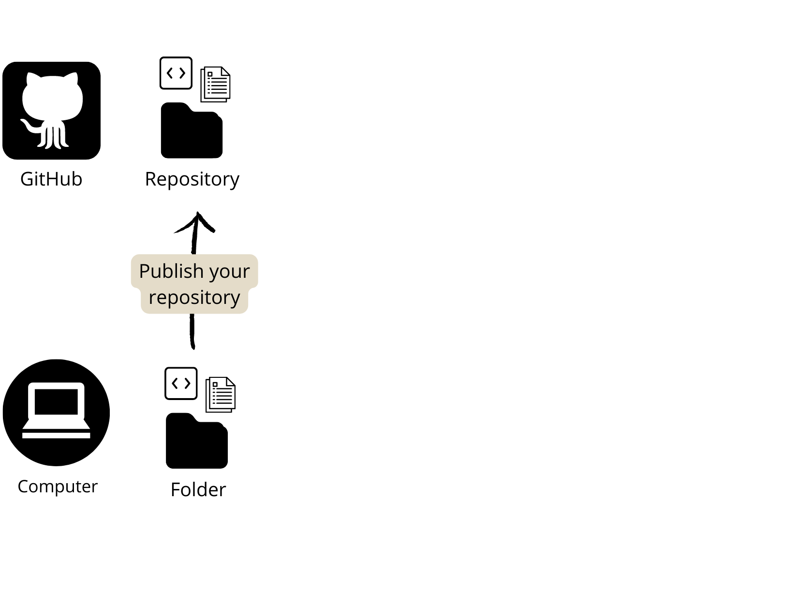
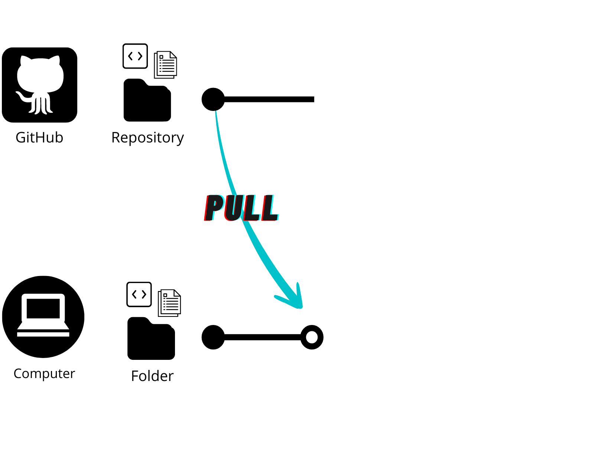
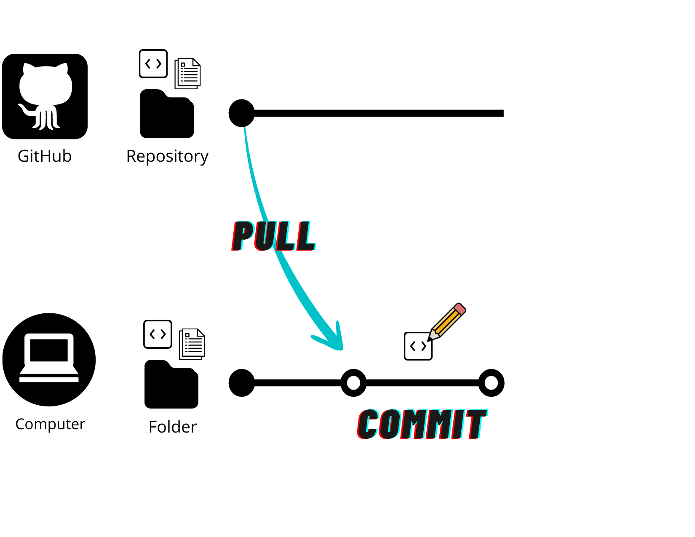
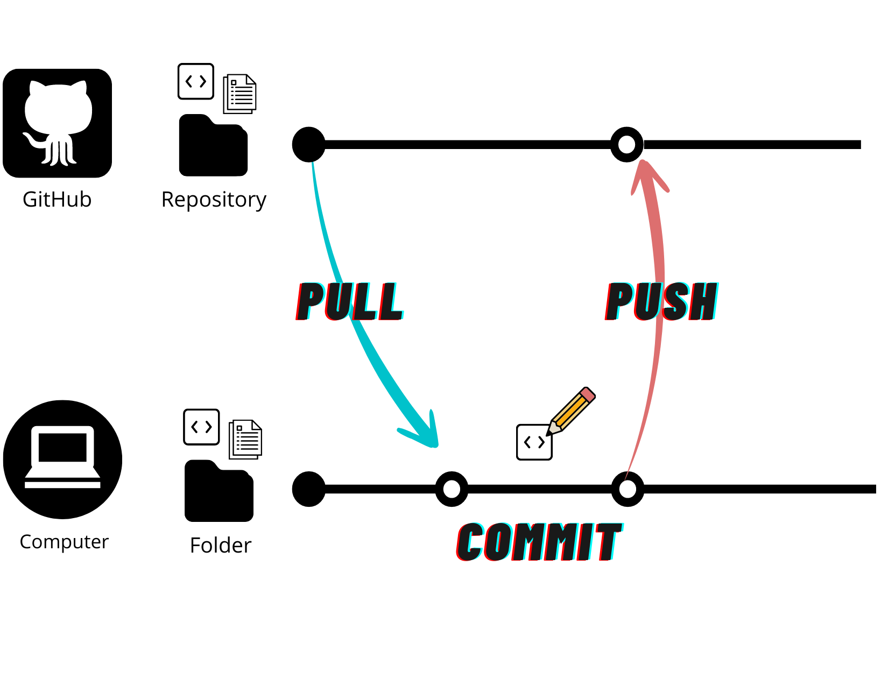

```{r setup, include=FALSE}
options(htmltools.dir.version = FALSE)

knitr::opts_chunk$set(
  collapse = TRUE,
  dev = 'jpeg',
  ffmpeg.format='gif',
  interval = 1/15
)

# Include packages to be loaded below here:
library(knitr)    # For knitting document and include_graphics function
library(ggplot2)  # For plotting
library(JuliaCall)
library(reticulate)
library(ggplot2)
library(png)      # For grabbing the dimensions of png files
```

class: middle

## 1. Brief introduction to [Git]() and [GitHub](github.com)

### a. What is GitHub and why should I use it?
### b. How can GitHub make research more open and collaborative?
<br>
## 2. Introduction to [GitHub Actions]()

### a. What are GitHub Actions and how do they work?
### b. How can my research benefit from GitHub Actions?

---
class: center, middle

## Why should I learn this?

---
class: inverse
### GitHub & GitHub Actions are powerful tools for collaboration and open science

GitHub is increasingly used by researchers as a tool to work on their research in an __open__ and __reproducible__ way. Like our science, GitHub is especially powerful in __collaborative__ contexts. 

Today's workshop will discuss:

- How GitHub can help you do open, transparent, and collaborative science (_briefly_)

- How to use GitHub Actions to automate some common tasks in research, to keep your work up to date as you (and your collaborators) contribute to a project
  - **Code checking** on a different system than your local computer
  - **Performing** analyses and making visualizations  
  - **Rendering** and __deploying__ documents (presentations, webpages, Shiny apps) 
  
- How to __troubleshoot__ GitHub Actions when they don't work!

???

> _.small[Today, we will spend less time on _how to use GitHub_ - but don't worry! There are many resources available freely online to learn about GitHub (e.g. [Happy Git and GitHub for the useR](https://happygitwithr.com/) by Jennifer Bryan). ]_

---
class: inverse
### A brief introduction to GitHub 

**GitHub** allows you to manage documents and code in a __transparent, collaborative, and traceable way__.

.pull-left[
#### Version Control

GitHub keeps tracks of the _changes_ you make to your documents, and allows you to flip back to previous versions if you need to.

#### Transparent & Open

You can work privately, but GitHub also allows you to open your repository (i.e. project folder) to the public. You can choose a [license](https://choosealicense.com/) to control how your documents can be used by others. 
]

.pull-right[
#### Collaborative Workflow

Features like branching, issues, and pull requests help to coordinate collaborations dynamically, so you can keep track of all contributions to a project in one place.

#### Automating Tasks 🌟

GitHub Actions automate tasks like code checks, document rendering, deploying webpages, and more. This becomes powerful quickly, particularly when you need to continuously integrate contributions to your project. 
]

???

Actions can also protect your project, by ensuring that changes are only integrated if they pass certain checks.

---
class: center, middle

## Q: Do you use GitHub for your research?

GitHub is becoming popular among researchers in biodiversity but it is still not widely adopted.

Have you encountered obstacles when learning how to use it? <br>
What are some reasons you would recommend it to others? <br>
Why do you think it is not widely adopted in biodiversity research?

---
class: center, middle

# Part I: A brief introduction to `GitHub`

---
## How GitHub works (in a nutshell)

__Git__ is an open source version-control system.

__GitHub__ is a platform for hosting and collaborating on Git repositories.

You can think of Git as a tool that allows you to _track the changes_ you make in your documents on your local computer, and apply them to the same documents that are hosted in a _repository_ on GitHub. 

Git also allows you to apply any changes that have been made on the GitHub repository (also called the _remote_) to the documents on your local computer.

---
class: center, middle

## The GitHub workflow: A basic example

---
### Step 1: Setting up a repository

{width=50%}

Let's say you have some project folder on your local computer that you want to publish as a repository on GitHub.

Note: A repository can be set up in several ways. You can also _clone_ a repository from GitHub to your local computer. 

???

repositories, files, directories, commits, pushes, pull requests, commit history, authors, cloning, and checkout. 
From GitHub Docs:
git: an open source, distributed version-control system
GitHub: a platform for hosting and collaborating on Git repositories
commit: a Git object, a snapshot of your entire repository compressed into a SHA
branch: a lightweight movable pointer to a commit
clone: a local version of a repository, including all commits and branches
remote: a common repository on GitHub that all team member use to exchange their changes
fork: a copy of a repository on GitHub owned by a different user
pull request: a place to compare and discuss the differences introduced on a branch with reviews, comments, integrated
tests, and more

---
### Step 2: Pull the _remote_ repository to your local computer.

{width=50%}

This ensures that the documents on your local computer match up with the versions on the _remote_ repository on GitHub.

---
### Step 3: _Commit_ changes to your local documents.



Let's say you need to edit your R script on your local computer. When you save your changes, Git will track them. More specifically, Git tracks the _addition_ and _deletion_ of any characters in your file. 

When you are ready to confirm this new version of your document, you stage and _commit_ your changes.

---
### Step 4: Push your committed changes to the _remote_ repository.



This _pushes_ your local changes to the remote repository.

Note: You can flip back and forth between these _commits_ to work on different versions of your documents. That means you don't have to keep saving files with ever-increasing file names (e.g. Final_draft_May2022_comments_June2022_finaledits.pdf).

---

## A basic _collaborative_ GitHub workflow

to do: same workflow diagrams, but with branches and pull requests

---
## Exercise: Set up a GitHub repository

Let's make a repository that we will use to play with GitHub Actions later in this workshop!

[Link to webpage with exercise]

.pull-left[
### If you are new to GitHub:

1. Create a GitHub account.
2. Install GitHub Desktop.
2. Create a repository.
3. Commit a change and push to web.

]

.pull-right[
### If you already use GitHub:

1. Create a repository.
2. Commit a change and push to web.
]


---
class: center, middle

# Part 2: Introduction to `GitHub Actions`

---
class: center, middle

# Discussion

----
## What are some examples of some research tasks you would like to automate?

???

Changing data collected in the second season in the field and automatically updating documents and analyses;
Automated literature mining ?;
Automated website and presentation generation?

---

## GitHub Actions workflows

