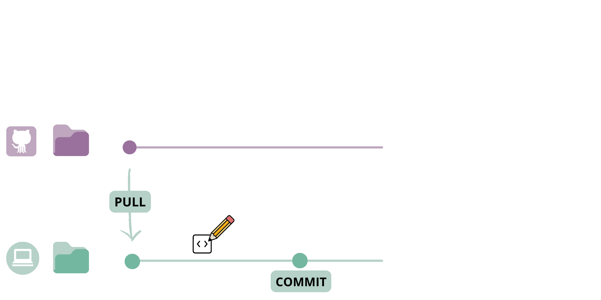

```{r setup, include=FALSE}
options(htmltools.dir.version = FALSE)

knitr::opts_chunk$set(
  collapse = TRUE,
  dev = 'jpeg',
  ffmpeg.format='gif',
  interval = 1/15
)


required.libraries <- c("ggplot2", "plotly", "RColorBrewer", # for visualisation
                        "devtools", "reticulate", "png", "knitr", "JuliaCall", "here"
)

needed.libraries <- required.libraries[!(required.libraries %in% 
                                           installed.packages()[ ,"Package"])]

if(length(needed.libraries)) install.packages(needed.libraries)

# Load all required libraries at once
lapply(required.libraries, library, character.only = TRUE, quietly = TRUE)


# Include packages to be loaded below here:
library(knitr)    # For knitting document and include_graphics function
library(ggplot2)  # For plotting
library(JuliaCall)
library(reticulate)
library(ggplot2)
library(png)      # For grabbing the dimensions of png files
```

class: middle

## 1. Brief introduction to [Git](https://git-scm.com/) and [GitHub](github.com)

### a. What is GitHub and why should I use it?
### b. How can GitHub make research more open and collaborative?
<br>
## 2. Introduction to [GitHub Actions](https://docs.github.com/en/actions)

### a. What are GitHub Actions and how do they work?
### b. How can my research benefit from GitHub Actions?

---
class: center, middle

## Why should I learn this?

---
class: inverse
### GitHub & GitHub Actions are powerful tools for collaboration and open science

GitHub is increasingly used by researchers as a tool to work on their research in an __open__ and __reproducible__ way. Like our science, GitHub is especially powerful in __collaborative__ contexts. 

Today's workshop will discuss:

- How GitHub can help you do open, transparent, and collaborative science (_briefly_)

- How to use GitHub Actions to automate some common tasks in research, to keep your work up to date as you (and your collaborators) contribute to a project
  - **Code checking** on a different system than your local computer
  - **Performing** analyses and making visualizations  
  - **Rendering** and __deploying__ documents (presentations, webpages, Shiny apps) 
  
- How to __troubleshoot__ GitHub Actions when they don't work!

???

> _.small[Today, we will spend less time on _how to use GitHub_ - but don't worry! There are many resources available freely online to learn about GitHub (e.g. [Happy Git and GitHub for the useR](https://happygitwithr.com/) by Jennifer Bryan). ]_

---
class: inverse
### A brief introduction to GitHub 

**GitHub** allows you to manage documents and code in a __transparent, collaborative, and traceable way__.

.pull-left[
#### Version Control

GitHub keeps tracks of the _changes_ you make to your documents, and allows you to flip back to previous versions if you need to.

#### Transparent & Open

You can work privately, but GitHub also allows you to open your repository (i.e. project folder) to the public. You can choose a [license](https://choosealicense.com/) to control how your documents can be used by others. 
]

.pull-right[
#### Collaborative Workflow

Features like branching, issues, and pull requests help to coordinate collaborations dynamically, so you can keep track of all contributions to a project in one place.

#### Automating Tasks 🌟

GitHub Actions automate tasks like code checks, document rendering, deploying webpages, and more. This becomes powerful quickly, particularly when you need to continuously integrate contributions to your project. 
]

???

Actions can also protect your project, by ensuring that changes are only integrated if they pass certain checks.

---
class: center, middle

## Q: Do you use GitHub for your research?

GitHub is becoming popular among researchers in biodiversity but it is still not widely adopted.

Have you encountered obstacles when learning how to use it? <br>
What are some reasons you would recommend it to others? <br>
Why do you think it is not widely adopted in biodiversity research?

---
class: center, middle

# Part I: A brief introduction to `GitHub`

---


.cite[Artwork by @allison_horst].

---

## How GitHub works (in a nutshell)

__Git__ is an open source version-control system.

__GitHub__ is a platform for hosting and collaborating on Git repositories.

You can think of Git as a tool that allows you to _track the changes_ you make in your documents on your local computer, and apply them to the same documents that are hosted in a _repository_ on GitHub. 

Git also allows you to apply any changes that have been made on the GitHub repository (also called the _remote_) to the documents on your local computer.

---
class: center, middle

## The GitHub workflow: A basic example

---
### Step 1: Setting up a repository.

Often, you have some project folder on your local computer that you want to __publish__ as a repository on GitHub.

```{r, echo = FALSE, eval = TRUE, out.width="75%"}
knitr::include_graphics("imgs/github_workflow/2.png")
```


???

Note: A repository can be set up in several ways. You can also _clone_ a repository from GitHub to your local computer. 

repositories, files, directories, commits, pushes, pull requests, commit history, authors, cloning, and checkout. 
From GitHub Docs:
git: an open source, distributed version-control system
GitHub: a platform for hosting and collaborating on Git repositories
commit: a Git object, a snapshot of your entire repository compressed into a SHA
branch: a lightweight movable pointer to a commit
clone: a local version of a repository, including all commits and branches
remote: a common repository on GitHub that all team member use to exchange their changes
fork: a copy of a repository on GitHub owned by a different user
pull request: a place to compare and discuss the differences introduced on a branch with reviews, comments, integrated
tests, and more

---
### Step 1: Setting up a repository.

You can also _clone_ or _fork_ a repository from GitHub to your local computer. 

```{r, echo = FALSE, eval = TRUE, out.width="75%"}
knitr::include_graphics("imgs/github_workflow/1.png")
```


---
### Step 2: Pull the _remote_ repository to your local computer.

Once a repository is set up, you usually want to get to work. __Pulling__ ensures that the documents on your local computer match up with the versions on the _remote_ repository on GitHub.

```{r, echo = FALSE, eval = TRUE, out.width="75%"}
knitr::include_graphics("imgs/github_workflow/3.png")
```

---
### Step 3: Make changes to the files on your local computer.

Now that everything matches up, you can start making some changes in your files. When you save changes to a file, Git tracks the _addition_ and _deletion_ of any characters. 

```{r, echo = FALSE, eval = TRUE, out.width="75%"}
knitr::include_graphics("imgs/github_workflow/4.png")
```

---
### Step 4: __Commit__ your changes.

When you are ready to confirm this new version of your document, you stage and _commit_ your changes. This essentially makes a _snapshot_ of the repository, from which you can flip back and forth.

```{r, echo = FALSE, eval = TRUE, out.width="75%"}

```

---
### Step 5: __Push__ your committed changes to the _remote_ repository.

You then __push__ the changes that you committed on your local computer to the _remote_ repository. 
<br><br>

```{r, echo = FALSE, eval = TRUE, out.width="75%"}
knitr::include_graphics("imgs/github_workflow/6.png")
```

???

Note: You can flip back and forth between these _commits_ to work on different versions of your documents. That means you don't have to keep saving files with ever-increasing file names (e.g. Final_draft_May2022_comments_June2022_finaledits.pdf).

---


.cite[Artwork by @allison_horst].

---

.cite[Artwork by @allison_horst].

---
## A __collaborative__ GitHub workflow

GitHub becomes even more powerful when you are working collaboratively in a repository. 

When working on a project with a collaborator, they can start a __new branch__ from the main repository. 

Branches are essentially a _working copy_ of the repository, where you can commit changes _without affecting the main repository_. 

Branches can be __merged __ into the main repository through a __pull request__, which can be reviewed and approved by the owner of the repository (or other authorized contributors). 

This is very helpful to manage contributions from different collaborators who are working on the same files at the same time!

Let's walk through an example of this workflow.

---
## Step 1: Make a new branch

```{r, echo = FALSE, eval = TRUE, out.width="75%"}

```

---
## Step 2: Commit changes in the files

```{r, echo = FALSE, eval = TRUE, out.width="75%"}
knitr::include_graphics("imgs/github_workflow/9.png")
```

---
## Step 3: Make a pull request

```{r, echo = FALSE, eval = TRUE, out.width="75%"}
knitr::include_graphics("imgs/github_workflow/10.png")
```

---
## Step 4: Merge the branch into the remote repository

```{r, echo = FALSE, eval = TRUE, out.width="75%"}
knitr::include_graphics("imgs/github_workflow/11.png")
```

---
## Exercise: Set up a GitHub repository

Let's make a repository that we will use to play with GitHub Actions later in this workshop!

[Link to webpage with exercise]

.pull-left[
### If you are new to GitHub:

1. Create a GitHub account.
2. Install GitHub Desktop.
2. Create a repository.
3. Commit a change and push to web.

]

.pull-right[
### If you already use GitHub:

1. Create a repository.
2. Commit a change and push to web.
]


---
class: center, middle

# Part 2: Introduction to `GitHub Actions`

---

### Common research workflows in ecology and evolution

.pull-left[
Research in ecology and evolution often involves the processing and merging of data from multiple sources.

We commonly combine, clean multiple data files (usually, types of spreadsheets) for subsequent analysis (in the form of code).

This process is rarely done just once in a project's lifetime: we add and remove information, and adjust our analysis. 

.onfire[This increases output generation and errors.]
]

.pull-right[

_Include diagram._

]

---
class: inverse

## Errors can be costly.

.pull-left[
.font90[
Humans, even diligent, meticulous and highly trained professionals, make mistakes.

Unsurprisingly, errors increase with lines of code [_e.g._, 15 to 50 errors to 1000 from professional software engineers; McConnell, 2044].

A sign error, a missing semicolon, an off-by-one error in matching columns of data may render the results complete noise (_e.g._, Chang _et al_. 2006, retraction from Science).

Rampant software errors may undermine scientific results (Soergel, 2015), cost money (_CITE_), and even imply in retractions (_CITE_).
]
]

.pull-right[


]

---
### Mitigating errors: no 'blind trust', and test early, test often

.pull-left[
Long-term recommendations (Joppa et al. 2013, Science):

1. Formal training in statistics, computational methods, mathematics, and software engineering;
2. Scientific publication of software and code, so it can be peer-reviewed.

Practical recommendations:
1. No 'blind trust': verify;
2. Test, test, test, and test early.

]

.pull-right[

]

???

In 2013, only 30% of researchers using SDMs reported that they used particular software because it had been "validated against other methods in peer-review publications. This rose to 57% for those who used "click-and-run" software with easy-to-manipulate user interfaces and dropped to 11% for those who used "syntax-driven" platforms. Further, 7, 9, and 18% of scientists cited "the developer is well-respected," "personal recommendation," and "recommendation from a close colleague," respectively, as reasons for using software. Only 8% claimed they had validated software against other methods as a primary reason for choice; 79% expressed a desire to learn additional software and programming skills.

---
### A structured computing workflow can help with reproducibility

A **computing workflow** can help strategically reproducing results every time data or code is modified.

.pull-left[
#### Primary criterion 
1. Reproducibility
]

.pull-right[
#### Secondary criteria

1. Accurate
2. Efficient
3. Scalable
4. Adaptable
5. Accessible

]

_Exemplify with GitHub_

Automated data and software management can help reduce the time and effort required by researchers (Yenni _et al_., 2018).


---

### Adopting automated research workflows in ecology and evolution

**Continuous integration (CI)** is a software development practice in which small adjustments to code are tested every time modifications happen or at user-specified times.

_Include diagram_

CI decreases integration problems [3], ensures
rapid feedback [4], increases software quality [2], and improves developer productivity [5].

.footnote[

1. Vasilescu _et al_. “Quality and productivity outcomes relating to continuous integration in GitHub,” in Proc. 2015 10th Joint Meet. on Found. of Soft. Engineering, 2015, pp. 805–816.

2. Stahl _et al_., “Big bangs and small pops: on critical cyclomatic complexity and developer integration behavior,” in 2019 IEEE/ACM 41st Int. Conf. Software Engineering: Software Engineering in Practice (ICSE-SEIP). IEEE, 2019, pp. 81–90

3. Rossi _et al_., “Continuous deployment of mobile software at facebook (showcase),” in Proceedings of the 2016 24th ACM SIGSOFT International
Symposium on Foundations of Software Engineering, 2016, pp. 12–23

4. M. Hilton, T. Tunnell, K. Huang, D. Marinov, and D. Dig, “Usage, costs, and benefits of continuous integration in open-source projects,” in 2016 31st IEEE/ACM International Conference on Automated Software Engineering (ASE). IEEE, 2016, pp. 426–437

]


---

#### Example 1: **[The Portal Project: a long-term study of a Chihuahuan desert ecosystem](https://www.biorxiv.org/content/10.1101/332783v3.full)**

.pull-right-35[

.small[Location of 24 experimental plots from a long-term (1977-) ecological study of rodents, plants, and ants in Portal, AZ, USA.]
]

--

.pull-left-65[


.small[[](https://doi.org/10.5281/zenodo.6672075)] : [weecology/PortalData](https://zenodo.org/record/6672075)

]

---

### Example 2: **Automated integration in collaborative manuscripts**

.pull-left-35[
**Manubot** 

]

.pull-right-65[


]


---

class: center, middle

# Discussion

----
## What are some examples of some research tasks you would like to automate?

???

Changing data collected in the second season in the field and automatically updating documents and analyses;
Automated literature mining ?;
Automated website and presentation generation?

---

## GitHub Actions workflows: __YAML__

.pull-left[
To make a workflow, you write a __YAML__ file that is stored in your repository, in a directory called `.github/workflows`.

YAML is a human-readable programming language. It is important to remember that _indentation matters_ in YAML!
]

.pull-right[
```{r, echo = FALSE, eval = TRUE, out.width="60%", fig.cap="An example of a YAML file containing a workflow."}

```
]

---

## GitHub Actions workflows: __Jobs__

A workflow is an automated process that runs one or more __jobs__. 

You can think of jobs as one or more tasks to complete, like running an R script to do some analysis, or building a PDF document from an RMarkdown file.

You can run a single job, but often you will need to configure your workflow to run several jobs. Jobs can run sequentially or in parallel.

---
## GitHub Actions workflows: __Jobs__

Each jobs runs inside its own _runner_ or container. Jobs include one or more _steps_ to achieve some objective (checking code, producing a document, etc.).

These steps can run a _script_ that you write or define yourself, or can run an _action_. _Actions_ are reusable extensions that you can use to simplify your workflow.

```{r, echo = FALSE, eval = TRUE, out.width="75%", fig.align = "center"}
knitr::include_graphics("imgs/overview-actions-simple.png") 
```

.cite[image from [GitHub Docs]((https://docs.github.com/en/actions/learn-github-actions/understanding-github-actions?learn=getting_started&learnProduct=actions)]

---

## GitHub Actions workflows: __Triggers__

Workflows run when they are __triggered__ by an event. 

To trigger a workflow, you can:

- __Manually__ start the workflow
- Define certain __events__ as triggers in your repository (e.g. _pushes_ to your `main` repository branch, a submitted _pull request_, someone posting a new _issue_, etc.)
- Set a __schedule__ to regularly trigger the workflow.

---


