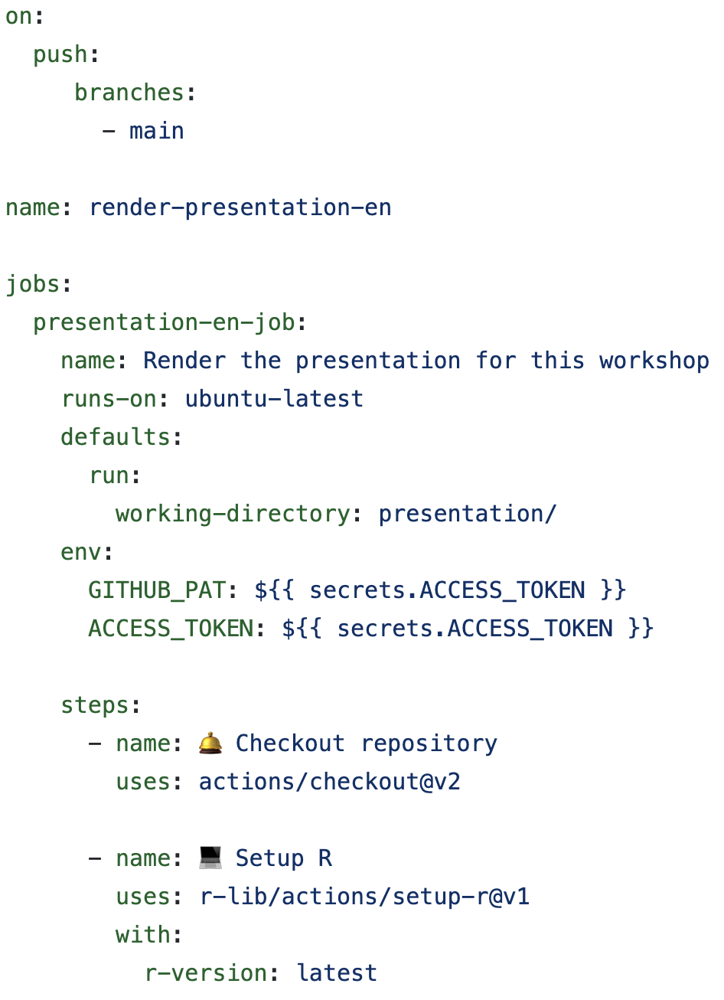

```{r setup, include=FALSE}
options(htmltools.dir.version = FALSE)

knitr::opts_chunk$set(
  collapse = TRUE,
  dev = 'jpeg',
  ffmpeg.format='gif',
  interval = 1/15
)


required.libraries <- c("ggplot2", "plotly", "RColorBrewer", # for visualisation
                        "devtools", "reticulate", "png", "knitr", "JuliaCall", "here"
)

needed.libraries <- required.libraries[!(required.libraries %in% 
                                           installed.packages()[ ,"Package"])]

if(length(needed.libraries)) install.packages(needed.libraries)

# Load all required libraries at once
lapply(required.libraries, library, character.only = TRUE, quietly = TRUE)


# Include packages to be loaded below here:
library(knitr)    # For knitting document and include_graphics function
library(ggplot2)  # For plotting
library(JuliaCall)
library(reticulate)
library(ggplot2)
library(png)      # For grabbing the dimensions of png files
```

class: middle

## 1. Brief introduction to [Git](https://git-scm.com/) and [GitHub](github.com)

### a. What is GitHub and why should I use it?
### b. How can GitHub make research more open and collaborative?
<br>
## 2. Introduction to [GitHub Actions](https://docs.github.com/en/actions)

### a. What are GitHub Actions and how do they work?
### b. How can my research benefit from GitHub Actions?

---
class: center, middle

## Why should I learn this?

---
class: inverse
### GitHub & GitHub Actions are powerful tools for collaboration and open science

GitHub is increasingly used by researchers as a tool to work on their research in an __open__ and __reproducible__ way. Like our science, GitHub is especially powerful in __collaborative__ contexts. 

Today's workshop will discuss:

- How GitHub can help you do open, transparent, and collaborative science (_briefly_)

- How to use GitHub Actions to automate some common tasks in research, to keep your work up to date as you (and your collaborators) contribute to a project
  - **Code checking** on a different system than your local computer
  - **Performing** analyses and making visualizations  
  - **Rendering** and __deploying__ documents (presentations, webpages, Shiny apps) 
  
- How to __troubleshoot__ GitHub Actions when they don't work!

???

> _.small[Today, we will spend less time on _how to use GitHub_ - but don't worry! There are many resources available freely online to learn about GitHub (e.g. [Happy Git and GitHub for the useR](https://happygitwithr.com/) by Jennifer Bryan). ]_

---
class: inverse
### A brief introduction to GitHub 

**GitHub** allows you to manage documents and code in a __transparent, collaborative, and traceable way__.

.pull-left[
#### Version Control

GitHub keeps tracks of the _changes_ you make to your documents, and allows you to flip back to previous versions if you need to.

#### Transparent & Open

You can work privately, but GitHub also allows you to open your repository (i.e. project folder) to the public. You can choose a [license](https://choosealicense.com/) to control how your documents can be used by others. 
]

.pull-right[
#### Collaborative Workflow

Features like branching, issues, and pull requests help to coordinate collaborations dynamically, so you can keep track of all contributions to a project in one place.

#### Automating Tasks 🌟

GitHub Actions automate tasks like code checks, document rendering, deploying webpages, and more. This becomes powerful quickly, particularly when you need to continuously integrate contributions to your project. 
]

???

Actions can also protect your project, by ensuring that changes are only integrated if they pass certain checks.

---
class: center, middle

## Q: Do you use GitHub for your research?

GitHub is becoming popular among researchers in biodiversity but it is still not widely adopted.

Have you encountered obstacles when learning how to use it? <br>
What are some reasons you would recommend it to others? <br>
Why do you think it is not widely adopted in biodiversity research?

---
class: center, middle

# Part I: A brief introduction to `GitHub`

---


.cite[Artwork by @allison_horst].

---

## How GitHub works (in a nutshell)

__Git__ is an open source version-control system.

__GitHub__ is a platform for hosting and collaborating on Git repositories.

You can think of Git as a tool that allows you to _track the changes_ you make in your documents on your local computer, and apply them to the same documents that are hosted in a _repository_ on GitHub. 

Git also allows you to apply any changes that have been made on the GitHub repository (also called the _remote_) to the documents on your local computer.

---
class: center, middle

## The GitHub workflow: A basic example

---
### Step 1: Setting up a repository.

Often, you have some project folder on your local computer that you want to __publish__ as a repository on GitHub.

```{r, echo = FALSE, eval = TRUE, out.width="75%"}
knitr::include_graphics("imgs/github_workflow/2.png")
```


???

Note: A repository can be set up in several ways. You can also _clone_ a repository from GitHub to your local computer. 

repositories, files, directories, commits, pushes, pull requests, commit history, authors, cloning, and checkout. 
From GitHub Docs:
git: an open source, distributed version-control system
GitHub: a platform for hosting and collaborating on Git repositories
commit: a Git object, a snapshot of your entire repository compressed into a SHA
branch: a lightweight movable pointer to a commit
clone: a local version of a repository, including all commits and branches
remote: a common repository on GitHub that all team member use to exchange their changes
fork: a copy of a repository on GitHub owned by a different user
pull request: a place to compare and discuss the differences introduced on a branch with reviews, comments, integrated
tests, and more

---
### Step 1: Setting up a repository.

You can also _clone_ or _fork_ a repository from GitHub to your local computer. 

```{r, echo = FALSE, eval = TRUE, out.width="75%"}
knitr::include_graphics("imgs/github_workflow/1.png")
```


---
### Step 2: Pull the _remote_ repository to your local computer.

Once a repository is set up, you usually want to get to work. __Pulling__ ensures that the documents on your local computer match up with the versions on the _remote_ repository on GitHub.

```{r, echo = FALSE, eval = TRUE, out.width="75%"}
knitr::include_graphics("imgs/github_workflow/3.png")
```

---
### Step 3: Make changes to the files on your local computer.

Now that everything matches up, you can start making some changes in your files. When you save changes to a file, Git tracks the _addition_ and _deletion_ of any characters. 

```{r, echo = FALSE, eval = TRUE, out.width="75%"}
knitr::include_graphics("imgs/github_workflow/4.png")
```

---
### Step 4: __Commit__ your changes.

When you are ready to confirm this new version of your document, you stage and _commit_ your changes. This essentially makes a _snapshot_ of the repository, from which you can flip back and forth.

```{r, echo = FALSE, eval = TRUE, out.width="75%"}
knitr::include_graphics("imgs/github_workflow/5.png")
```

---
### Step 5: __Push__ your committed changes to the _remote_ repository.

You then __push__ the changes that you committed on your local computer to the _remote_ repository. 
<br><br>

```{r, echo = FALSE, eval = TRUE, out.width="75%"}
knitr::include_graphics("imgs/github_workflow/6.png")
```

???

Note: You can flip back and forth between these _commits_ to work on different versions of your documents. That means you don't have to keep saving files with ever-increasing file names (e.g. Final_draft_May2022_comments_June2022_finaledits.pdf).

---


.cite[Artwork by @allison_horst].

---

.cite[Artwork by @allison_horst].

---
## A __collaborative__ GitHub workflow

GitHub becomes even more powerful when you are working collaboratively in a repository. 

When working on a project with a collaborator, they can start a __new branch__ from the main repository. 

Branches are essentially a _working copy_ of the repository, where you can commit changes _without affecting the main repository_. 

Branches can be __merged __ into the main repository through a __pull request__, which can be reviewed and approved by the owner of the repository (or other authorized contributors). 

This is very helpful to manage contributions from different collaborators who are working on the same files at the same time!

Let's walk through an example of this workflow.

---
## Step 1: Make a new branch

```{r, echo = FALSE, eval = TRUE, out.width="75%"}
knitr::include_graphics("imgs/github_workflow/7.png")
```

---
## Step 2: Commit changes in the files

```{r, echo = FALSE, eval = TRUE, out.width="75%"}
knitr::include_graphics("imgs/github_workflow/9.png")
```

---
## Step 3: Make a pull request

```{r, echo = FALSE, eval = TRUE, out.width="75%"}
knitr::include_graphics("imgs/github_workflow/10.png")
```

---
## Step 4: Merge the branch into the remote repository

```{r, echo = FALSE, eval = TRUE, out.width="75%"}
knitr::include_graphics("imgs/github_workflow/11.png")
```

---
## Exercise: Set up a GitHub repository

Let's make a repository that we will use to play with GitHub Actions later in this workshop!

[Link to webpage with exercise]

.pull-left[
### If you are new to GitHub:

1. Create a GitHub account.
2. Install GitHub Desktop.
2. Create a repository.
3. Commit a change and push to web.

]

.pull-right[
### If you already use GitHub:

1. Create a repository.
2. Commit a change and push to web.
]


---
class: center, middle

# Part 2: Introduction to `GitHub Actions`

---

### Common research workflows in ecology and evolution

.pull-left[
Research in ecology and evolution often involves the processing and merging of data from multiple sources.

We commonly combine, clean multiple data files (usually, types of spreadsheets) for subsequent analysis (in the form of code).

This process is rarely done just once in a project's lifetime: we add and remove information, and adjust our analysis. 

.onfire[This increases output generation and errors.]
]

.pull-right[

_Include diagram._

]
---

### Adopting automated research workflows in ecology and evolution

Continuous integration (CI) is a software development practice in which small adjustments to the underlying code in an application are tested every time a team member makes changes.

CI decreases integration problems [3], ensures
rapid feedback [4], increases software quality [2], and improves developer productivity [5].

.footnote[
Vasilescu _et al_. “Quality and productivity outcomes relating to continuous integration in GitHub,” in Proc. 2015 10th Joint Meet. on Found. of Soft. Engineering, 2015, pp. 805–816.

Stahl _et al_., “Big bangs and small pops: on critical cyclomatic complexity and developer integration behavior,” in 2019 IEEE/ACM 41st Int. Conf. Software Engineering: Software Engineering in Practice (ICSE-SEIP). IEEE, 2019, pp. 81–90

Rossi _et al_., “Continuous deployment of mobile software at facebook (showcase),” in Proceedings of the 2016 24th ACM SIGSOFT International
Symposium on Foundations of Software Engineering, 2016, pp. 12–23

M. Hilton, T. Tunnell, K. Huang, D. Marinov, and D. Dig, “Usage, costs, and benefits of continuous integration in open-source
projects,” in 2016 31st IEEE/ACM International Conference on Automated Software Engineering (ASE). IEEE, 2016, pp. 426–437

]


---

# 

---
class: inverse

## Test early, test often

Humans, even diligent, meticulous and highly trained professionals, make mistakes.


---

class: center, middle

# Discussion

----
## What are some examples of some research tasks you would like to automate?

???

Changing data collected in the second season in the field and automatically updating documents and analyses;
Automated literature mining ?;
Automated website and presentation generation?

---

class: center, middle

# GitHub Actions: Workflows


---

## Workflows are written in __YAML__.

.pull-left[
To make a workflow, you write a __YAML__ file that is stored in your repository, in a directory called `.github/workflows`.

YAML is a human-readable programming language. It is important to remember that _indentation matters_ in YAML!

]

.pull-right[
```{r, echo = FALSE, eval = TRUE, out.width="60%", fig.cap="An example of a YAML file containing a workflow."}

```
]

---

## __Events__ trigger the workflow.

.pull-left[

Workflows run when they are __triggered__ by an event. 

To trigger a workflow, you can:

- __Manually__ start the workflow
- Define triggers `on` __events__ in your repository (e.g. _pushes_ to your `main` repository branch, a _pull request_, a new _issue_, etc.)
- Set a __schedule__ to regularly trigger the workflow.

]

.pull-right[
.scroll-box-20[
```{yaml, eval = FALSE}
{{on: }}
{{  push: }}
{{     branches: }}
{{       - main }}

name: render-presentation-en

jobs:
  presentation-en-job:
    name: Render the presentation for this workshop
    runs-on: ubuntu-latest
    defaults:
      run:
        working-directory: presentation/
    env:
      GITHUB_PAT: ${{ secrets.ACCESS_TOKEN }}
      ACCESS_TOKEN: ${{ secrets.ACCESS_TOKEN }}    
        
    steps:
      - name: 🛎️ Checkout repository
        uses: actions/checkout@v2

      - name: 💻 Setup R
        uses: r-lib/actions/setup-r@v1
        with:
          r-version: latest
```

]
]

---

## The workflow runs __jobs__.

.pull-left[
A workflow is an automated process that runs one or more __jobs__. 

Jobs include one or more _steps_ to achieve some objective (checking code, producing a document, etc.).

You can run a single job, but often you will need to configure your workflow to run several jobs. 

Jobs can run sequentially or in parallel.

]

.pull-right[
.scroll-box-20[
```{yaml, eval = FALSE}
on: 
  push: 
     branches: 
       - main

name: render-presentation-en

{{jobs:}}
{{  presentation-en-job:}}
{{    name: Render the presentation for this workshop}}
    runs-on: ubuntu-latest
    defaults:
      run:
        working-directory: presentation/
    env:
      GITHUB_PAT: ${{ secrets.ACCESS_TOKEN }}
      ACCESS_TOKEN: ${{ secrets.ACCESS_TOKEN }}  

    steps:
      - name: 🛎️Checkout repository
        uses: actions/checkout@v2

      - name: 💻 Setup R
        uses: r-lib/actions/setup-r@v1
        with:
          r-version: latest
```

]
]

---

### Our `deploy-presentation-en` workflow runs __two jobs__.


---

## Jobs are run by __runners__.

.pull-left[
A _runner_ is a server that runs your workflows in a __*fresh* virtual machine__ each time it is triggered. 

Each runner runs one job at a time.

GitHub offers __Ubuntu Linux, Microsoft Windows, and macOS__ runners. This means you can test your scripts and documents on different systems, to ensure your files work the same for everyone else!

]

.pull-right[
.scroll-box-20[
```{yaml, eval = FALSE}
on: 
  push: 
     branches: 
       - main

name: render-presentation-en

jobs:
  presentation-en-job:
    name: Render the presentation for this workshop
{{   runs-on: ubuntu-latest}}
    defaults:
      run:
        working-directory: presentation/
    env:
      GITHUB_PAT: ${{ secrets.ACCESS_TOKEN }}
      ACCESS_TOKEN: ${{ secrets.ACCESS_TOKEN }}  

    steps:
      - name: 🛎️ Checkout repository
        uses: actions/checkout@v2

      - name: 💻 Setup R 
        uses: r-lib/actions/setup-r@v1
        with:
          r-version: latest
        
       - name: 💻 Install R packages and dependencies if needed
        run: |
          Rscript -e 'install.packages("palmerpenguins", dependencies = TRUE)'
        
        - name: 🧶 Render presentation
        run: Rscript -e 'rmarkdown::render("IntroToGitHub_GitHubActions_QCBSRSym2022_KH_PHPB_en.Rmd")'
        
        - name: 🔺 Upload artifact containing the presentation
        uses: actions/upload-artifact@v3
        with:
          name: presentation-en
          path: presentation

  checkout-and-deploy:
   name: Checkout and deploy the presentation within the gh-pages repository
{{   runs-on: ubuntu-latest}}
   needs: presentation-en-job
   
   steps:
      - name: 🛎️ Checkout again
        uses: actions/checkout@v2.3.1 # If you're using actions/checkout@v2 you must set persist-credentials to false in most cases for the deployment to work correctly.
        with:
          persist-credentials: false
          
     - name: 🔻 Download artifact containing the presentation
        uses: actions/download-artifact@v1
        with:
         # Artifact name
         name: presentation-en # optional
         # Destination path
         path: presentation/ # optional

      - name: 💎 Deploy to GitHub Pages
        uses: JamesIves/github-pages-deploy-action@4.1.4
        with:
          token: ${{ secrets.ACCESS_TOKEN }}
          branch: gh-pages # The branch the action should deploy to.
          folder: presentation/
          target-folder: presentation-en # The folder the action should deploy
          clean: true
```

]
]

---
## Jobs are run in a __working directory__.

.pull-left[
Text here

]

.pull-right[
.scroll-box-20[
```{yaml, eval = FALSE}
on: 
  push: 
     branches: 
       - main

name: render-presentation-en

jobs:
  presentation-en-job:
    name: Render the presentation for this workshop
   runs-on: ubuntu-latest
    defaults:
      run:
{{        working-directory: presentation/}}
    env:
      GITHUB_PAT: ${{ secrets.ACCESS_TOKEN }}
      ACCESS_TOKEN: ${{ secrets.ACCESS_TOKEN }}  

    steps:
      - name: 🛎️ Checkout repository
        uses: actions/checkout@v2

      - name: 💻 Setup R 
        uses: r-lib/actions/setup-r@v1
        with:
          r-version: latest
        
       - name: 💻 Install R packages and dependencies if needed
        run: |
          Rscript -e 'install.packages("palmerpenguins", dependencies = TRUE)'
        
        - name: 🧶 Render presentation
        run: Rscript -e 'rmarkdown::render("IntroToGitHub_GitHubActions_QCBSRSym2022_KH_PHPB_en.Rmd")'
        
        - name: 🔺 Upload artifact containing the presentation
        uses: actions/upload-artifact@v3
        with:
          name: presentation-en
          path: presentation

  checkout-and-deploy:
   name: Checkout and deploy the presentation within the gh-pages repository
   runs-on: ubuntu-latest
   needs: presentation-en-job
   
   steps:
      - name: 🛎️ Checkout again
        uses: actions/checkout@v2.3.1 # If you're using actions/checkout@v2 you must set persist-credentials to false in most cases for the deployment to work correctly.
        with:
          persist-credentials: false
          
     - name: 🔻 Download artifact containing the presentation
        uses: actions/download-artifact@v1
        with:
         # Artifact name
         name: presentation-en # optional
         # Destination path
         path: presentation/ # optional

      - name: 💎 Deploy to GitHub Pages
        uses: JamesIves/github-pages-deploy-action@4.1.4
        with:
          token: ${{ secrets.ACCESS_TOKEN }}
          branch: gh-pages # The branch the action should deploy to.
          folder: presentation/
          target-folder: presentation-en # The folder the action should deploy
          clean: true
```

]
]

---
## Jobs can use __environmental variables__. 

.pull-left[
Environmental variables are then accessible for all steps within a job.

]

.pull-right[
.scroll-box-20[
```{yaml, eval = FALSE}
on: 
  push: 
     branches: 
       - main

name: render-presentation-en

jobs:
  presentation-en-job:
    name: Render the presentation for this workshop
   runs-on: ubuntu-latest
    defaults:
      run:
        working-directory: presentation/
{{    env:}}
{{      GITHUB_PAT: ${{ secrets.ACCESS_TOKEN }}}}
{{      ACCESS_TOKEN: ${{ secrets.ACCESS_TOKEN }}}}

    steps:
      - name: 🛎️ Checkout repository
        uses: actions/checkout@v2

      - name: 💻 Setup R 
        uses: r-lib/actions/setup-r@v1
        with:
          r-version: latest
        
       - name: 💻 Install R packages and dependencies if needed
        run: |
          Rscript -e 'install.packages("palmerpenguins", dependencies = TRUE)'
        
        - name: 🧶 Render presentation
        run: Rscript -e 'rmarkdown::render("IntroToGitHub_GitHubActions_QCBSRSym2022_KH_PHPB_en.Rmd")'
        
        - name: 🔺 Upload artifact containing the presentation
        uses: actions/upload-artifact@v3
        with:
          name: presentation-en
          path: presentation

  checkout-and-deploy:
   name: Checkout and deploy the presentation within the gh-pages repository
   runs-on: ubuntu-latest
   needs: presentation-en-job
   
   steps:
      - name: 🛎️ Checkout again
        uses: actions/checkout@v2.3.1 # If you're using actions/checkout@v2 you must set persist-credentials to false in most cases for the deployment to work correctly.
        with:
          persist-credentials: false
          
     - name: 🔻 Download artifact containing the presentation
        uses: actions/download-artifact@v1
        with:
         # Artifact name
         name: presentation-en # optional
         # Destination path
         path: presentation/ # optional

      - name: 💎 Deploy to GitHub Pages
        uses: JamesIves/github-pages-deploy-action@4.1.4
        with:
          token: ${{ secrets.ACCESS_TOKEN }}
          branch: gh-pages # The branch the action should deploy to.
          folder: presentation/
          target-folder: presentation-en # The folder the action should deploy
          clean: true
```
]
]

---

## Each job runs a series of __steps__.

.pull-left[
You usually need to combine several _steps_ to complete a job.

A step can run a _script_ that you write or can run an _action_. 
]

.pull-right[
.scroll-box-20[
```{yaml, eval = FALSE}
on: 
  push: 
     branches: 
       - main

name: render-presentation-en

jobs:
  presentation-en-job:
    name: Render the presentation for this workshop
   runs-on: ubuntu-latest
    defaults:
      run:
        working-directory: presentation/
    env:
      GITHUB_PAT: ${{ secrets.ACCESS_TOKEN }}
      ACCESS_TOKEN: ${{ secrets.ACCESS_TOKEN }}

{{    steps:}}
{{      - name: 🛎️ Checkout repository}}
        uses: actions/checkout@v2

{{      - name: 💻 Setup R }}
        uses: r-lib/actions/setup-r@v1
        with:
          r-version: latest
        
{{        - name: 💻 Install R packages and dependencies if needed}}
        run: |
          Rscript -e 'install.packages("palmerpenguins", dependencies = TRUE)'
        
{{        - name: 🧶 Render presentation}}
        run: Rscript -e 'rmarkdown::render("IntroToGitHub_GitHubActions_QCBSRSym2022_KH_PHPB_en.Rmd")'
        
{{        - name: 🔺 Upload artifact containing the presentation}}
        uses: actions/upload-artifact@v3
        with:
          name: presentation-en
          path: presentation

  checkout-and-deploy:
   name: Checkout and deploy the presentation within the gh-pages repository
   runs-on: ubuntu-latest
   needs: presentation-en-job
   
{{   steps:}}
{{      - name: 🛎️ Checkout again}}
        uses: actions/checkout@v2.3.1 # If you're using actions/checkout@v2 you must set persist-credentials to false in most cases for the deployment to work correctly.
        with:
          persist-credentials: false
          
{{      - name: 🔻 Download artifact containing the presentation}}
        uses: actions/download-artifact@v1
        with:
         # Artifact name
         name: presentation-en # optional
         # Destination path
         path: presentation/ # optional

{{      - name: 💎 Deploy to GitHub Pages}}
        uses: JamesIves/github-pages-deploy-action@4.1.4
        with:
          token: ${{ secrets.ACCESS_TOKEN }}
          branch: gh-pages # The branch the action should deploy to.
          folder: presentation/
          target-folder: presentation-en # The folder the action should deploy
          clean: true
```

]
]

---

### For example, our first job runs a series of __steps__.


.small[_The workflow presented here is simplified, and might be missing some steps that you can see on the repository._]

---

## GitHub Actions Workflow: Recap


<br><br>
```{r, echo = FALSE, eval = TRUE, out.width="75%", fig.align = "center"}
knitr::include_graphics("imgs/overview-actions-simple.png") 
```

<br><br>
.right[.cite[[GitHub Docs]((https://docs.github.com/en/actions/learn-github-actions/understanding-github-actions?learn=getting_started&learnProduct=actions)]]

---

class: center, middle

# How to use GitHub Actions

---

## __GitHub Actions__ perform tasks 

.pull-left-35[

A __GitHub Action__ is an application that performs a task. 

This task is usually something that is __repeated__ often, such as setting up an environment to build your documents, installing R, and building documents like presentations or websites.

Actions help to _simplify_ your workflow.

]

.pull-right-65[
.shout[You can look for Actions on [__GitHub Marketplace__](https://github.com/marketplace?category=&query=&type=actions&verification=).]


]

???

You can also [create](https://docs.github.com/en/actions/creating-actions/about-custom-actions?learn=create_actions&learnProduct=actions) your own Action, but you can usually find Actions that do what you need them to do!

https://github.com/r-lib/actions
---

## __GitHub Actions__: checkout

.pull-left[For example, the first step in our workflow is to __checkout the repository__. To do this, we `use` the [checkout](https://github.com/actions/checkout) action.

This action takes care of checking out your repository under `$GITHUB_WORKSPACE`, so that your workflow can access it to do the next tasks.

]

.pull-right[
.scroll-box-20[
```{yaml, eval = FALSE}
...
   steps:
      - name: 🛎️ Checkout repository 
{{      uses: actions/checkout@v2 }} 

      - name: 💻 Setup R
        uses: r-lib/actions/setup-r@v1
        with:
          r-version: latest
        
        - name: 💻 Install R packages and dependencies if needed
        run: |
          Rscript -e 'install.packages("palmerpenguins", dependencies = TRUE)'
        
        - name: 🧶 Render presentation
        run: Rscript -e 'rmarkdown::render("IntroToGitHub_GitHubActions_QCBSRSym2022_KH_PHPB_en.Rmd")'
        
        - name: 🔺 Upload artifact containing the presentation
        uses: actions/upload-artifact@v3
        with:
          name: presentation-en
          path: presentation

  checkout-and-deploy:
   name: Checkout and deploy the presentation within the gh-pages repository
   runs-on: ubuntu-latest
   needs: presentation-en-job
   
   steps:
      - name: 🛎️ Checkout again
        uses: actions/checkout@v2.3.1 # If you're using actions/checkout@v2 you must set persist-credentials to false in most cases for the deployment to work correctly.
        with:
          persist-credentials: false
          
      - name: 🔻 Download artifact containing the presentation
        uses: actions/download-artifact@v1
        with:
         # Artifact name
         name: presentation-en # optional
         # Destination path
         path: presentation/ # optional

      - name: 💎 Deploy to GitHub Pages
        uses: JamesIves/github-pages-deploy-action@4.1.4
        with:
          token: ${{ secrets.ACCESS_TOKEN }}
          branch: gh-pages # The branch the action should deploy to.
          folder: presentation/
          target-folder: presentation-en # The folder the action should deploy
          clean: true
```

]
]

---

## __GitHub Actions__: Set up R

.pull-left[

We then need to __set up__ R on our Ubuntu runner (remember - it's fresh! new!). To do this, we `use` the [setup-r](https://github.com/r-lib/actions/tree/v2/setup-r) action. 

See [r-lib/actions](https://github.com/r-lib/actions) for more Actions for R.

]

.pull-right[
.scroll-box-20[
```{yaml, eval = FALSE}
...
   steps:
      - name: 🛎️ Checkout repository 
      uses: actions/checkout@v2 

      - name: 💻 Setup R
        {{uses: r-lib/actions/setup-r@v1}}
        {{with:}}
          {{r-version: latest}}
        
        - name: 💻 Install R packages and dependencies if needed
        run: |
          Rscript -e 'install.packages("palmerpenguins", dependencies = TRUE)'
        
        - name: 🧶 Render presentation
        run: Rscript -e 'rmarkdown::render("IntroToGitHub_GitHubActions_QCBSRSym2022_KH_PHPB_en.Rmd")'
        
        - name: 🔺 Upload artifact containing the presentation
        uses: actions/upload-artifact@v3
        with:
          name: presentation-en
          path: presentation

  checkout-and-deploy:
   name: Checkout and deploy the presentation within the gh-pages repository
   runs-on: ubuntu-latest
   needs: presentation-en-job
   
   steps:
      - name: 🛎️ Checkout again
        uses: actions/checkout@v2.3.1 # If you're using actions/checkout@v2 you must set persist-credentials to false in most cases for the deployment to work correctly.
        with:
          persist-credentials: false
          
      - name: 🔻 Download artifact containing the presentation
        uses: actions/download-artifact@v1
        with:
         # Artifact name
         name: presentation-en # optional
         # Destination path
         path: presentation/ # optional

      - name: 💎 Deploy to GitHub Pages
        uses: JamesIves/github-pages-deploy-action@4.1.4
        with:
          token: ${{ secrets.ACCESS_TOKEN }}
          branch: gh-pages # The branch the action should deploy to.
          folder: presentation/
          target-folder: presentation-en # The folder the action should deploy
          clean: true
```

]
]

---

## __GitHub Actions__: you can use R!

.pull-left[

GitHub Actions are particularly useful for _complex_ steps in your job.

For simpler tasks, you can run __R code__ directly in your workflow using this syntax:

```{r, eval = FALSE}
Rscript -e 'code here'
```

]

.pull-right[
.scroll-box-20[
```{yaml, eval = FALSE}
...
   steps:
      - name: 🛎️ Checkout repository 
      uses: actions/checkout@v2 

      - name: 💻 Setup R
        uses: r-lib/actions/setup-r@v1
        with:
          r-version: latest
        
        {{- name: 💻 Install R packages and dependencies if needed}}
        {{run: Rscript -e 'install.packages("palmerpenguins", dependencies = TRUE)'}}
        
        {{- name: 🧶 Render presentation}}
        {{run: Rscript -e 'rmarkdown::render("IntroToGitHub_GitHubActions_QCBSRSym2022_KH_PHPB_en.Rmd")'}}
        
        - name: 🔺 Upload artifact containing the presentation
        uses: actions/upload-artifact@v3
        with:
          name: presentation-en
          path: presentation

  checkout-and-deploy:
   name: Checkout and deploy the presentation within the gh-pages repository
   runs-on: ubuntu-latest
   needs: presentation-en-job
   
   steps:
      - name: 🛎️ Checkout again
        uses: actions/checkout@v2.3.1 # If you're using actions/checkout@v2 you must set persist-credentials to false in most cases for the deployment to work correctly.
        with:
          persist-credentials: false
          
      - name: 🔻 Download artifact containing the presentation
        uses: actions/download-artifact@v1
        with:
         # Artifact name
         name: presentation-en # optional
         # Destination path
         path: presentation/ # optional

      - name: 💎 Deploy to GitHub Pages
        uses: JamesIves/github-pages-deploy-action@4.1.4
        with:
          token: ${{ secrets.ACCESS_TOKEN }}
          branch: gh-pages # The branch the action should deploy to.
          folder: presentation/
          target-folder: presentation-en # The folder the action should deploy
          clean: true
```

]
]

---

---

## __GitHub Actions__: artifacts

.pull-left[

TEXT HERE

]

.pull-right[
.scroll-box-20[
```{yaml, eval = FALSE}
...
   steps:
      - name: 🛎️ Checkout repository 
      uses: actions/checkout@v2 

      - name: 💻 Setup R
        uses: r-lib/actions/setup-r@v1
        with:
          r-version: latest
        
        - name: 💻 Install R packages and dependencies if needed
          run: Rscript -e 'install.packages("palmerpenguins", dependencies = TRUE)'
        
        - name: 🧶 Render presentation
          run: Rscript -e 'rmarkdown::render("IntroToGitHub_GitHubActions_QCBSRSym2022_KH_PHPB_en.Rmd")'
        
        - name: 🔺 Upload artifact containing the presentation
          uses: actions/upload-artifact@v3
          with:
            name: presentation-en
            path: presentation

  checkout-and-deploy:
   name: Checkout and deploy the presentation within the gh-pages repository
   runs-on: ubuntu-latest
   needs: presentation-en-job
   
   steps:
      - name: 🛎️ Checkout again
        uses: actions/checkout@v2.3.1 # If you're using actions/checkout@v2 you must set persist-credentials to false in most cases for the deployment to work correctly.
        with:
          persist-credentials: false
          
      - name: 🔻 Download artifact containing the presentation
        uses: actions/download-artifact@v1
        with:
         # Artifact name
         name: presentation-en # optional
         # Destination path
         path: presentation/ # optional

      - name: 💎 Deploy to GitHub Pages
        uses: JamesIves/github-pages-deploy-action@4.1.4
        with:
          token: ${{ secrets.ACCESS_TOKEN }}
          branch: gh-pages # The branch the action should deploy to.
          folder: presentation/
          target-folder: presentation-en # The folder the action should deploy
          clean: true
```

]
]

---

