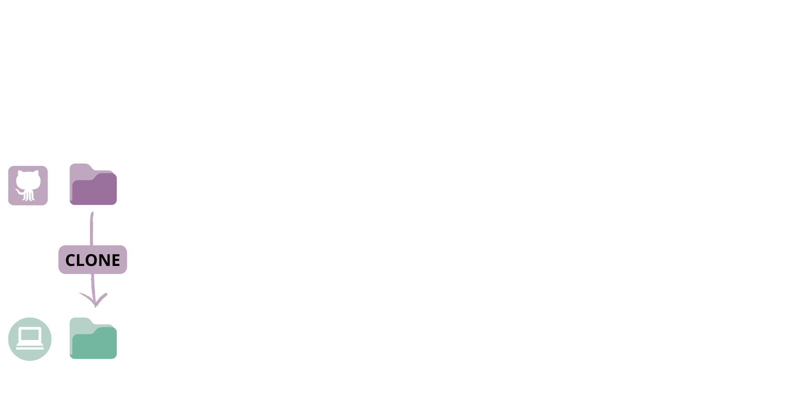
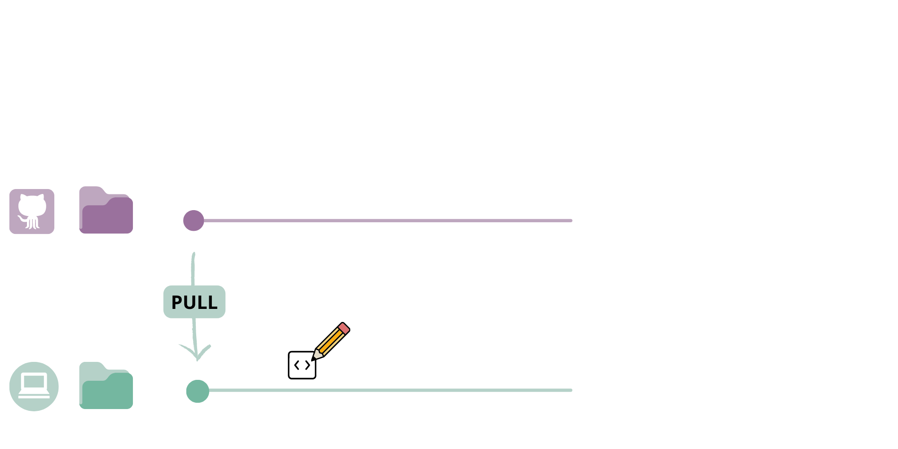

```{r setup, include=FALSE}
options(htmltools.dir.version = FALSE)

knitr::opts_chunk$set(
  collapse = TRUE,
  dev = 'jpeg',
  ffmpeg.format='gif',
  interval = 1/15
)


required.libraries <- c("devtools", "knitr", "here")

needed.libraries <- required.libraries[!(required.libraries %in%
                                           installed.packages()[ ,"Package"])]

if(length(needed.libraries)) install.packages(needed.libraries)

# Load all required libraries at once
lapply(required.libraries, library, character.only = TRUE, quietly = TRUE)


# Include packages to be loaded below here:
library(knitr)    # For knitting document and include_graphics function
library(devtools)
library(here)
```

class: middle

## 1. Brief introduction to [Git](https://git-scm.com/) and [GitHub](github.com)

### a. What is GitHub and why should I use it?
### b. How can GitHub make research more open and collaborative?
<br>
## 2. Introduction to [GitHub Actions](https://docs.github.com/en/actions)

### a. What are GitHub Actions and how do they work?
### b. How can my research benefit from GitHub Actions?

---
class: middle, center


---
class: center, middle, inverse

# What is GitHub and why should I use it?

---

### A brief introduction to GitHub

**GitHub** allows you to manage documents and code in a __transparent, collaborative, and traceable way__.

.pull-left[
#### Version Control

GitHub keeps tracks of _changes_, allowing you to flip between versions.

#### Transparent & Open

A public repository shows the complete history of contributions to your project, and opens access to your code or documents for use by others (tip: choose a [license](https://choosealicense.com/)).
]

--

.pull-right[
#### Collaborative Workflow

Track and integrate contributions from collaborators dynamically, in one place.

#### Automating Tasks 🌟

GitHub Actions automate tasks in a continuously integrated workflow.
]

???

Actions can also protect your project, by ensuring that changes are only integrated if they pass certain checks.

---
class: center, middle

## _Q_: How can GitHub make research more open and collaborative?

GitHub is becoming popular among researchers in biodiversity but it is still not widely adopted.

Why do you think it is not widely adopted in biodiversity research? <br>
What are some obstacles to using GitHub? <br>
What are some reasons you want to learn it, or would recommend it to others? <br>

???

Reluctance? Time constraints? Complexity? Lack of training?

---
class: center, middle, inverse

# Part I: A brief introduction to `GitHub`

---


.cite[Artwork by @allison_horst].

---

.pull-left-65[

### How GitHub works (in a nutshell)

__GitHub__ is a platform for hosting and collaborating on __Git__ repositories.

Git is a __version-control system__ that _tracks changes_ made to documents hosted in your local computer, and apply them to the same documents hosted in a _repository_ on GitHub.

Git also allows you to __pull__ any changes that have been made on the GitHub _remote_ repository to the documents on your local computer.

]

.pull-right-35[

.center[


]
]

---
class: center, middle, inverse

## The GitHub workflow: A basic example

---
### Step 1: Setting up a repository.

Often, you have some project folder on your local computer that you want to __publish__ as a repository on GitHub.

```{r, echo = FALSE, eval = TRUE, out.width="75%"}

```


???

Note: A repository can be set up in several ways. You can also _clone_ a repository from GitHub to your local computer.

repositories, files, directories, commits, pushes, pull requests, commit history, authors, cloning, and checkout.
From GitHub Docs:
git: an open source, distributed version-control system
GitHub: a platform for hosting and collaborating on Git repositories
commit: a Git object, a snapshot of your entire repository compressed into a SHA
branch: a lightweight movable pointer to a commit
clone: a local version of a repository, including all commits and branches
remote: a common repository on GitHub that all team member use to exchange their changes
fork: a copy of a repository on GitHub owned by a different user
pull request: a place to compare and discuss the differences introduced on a branch with reviews, comments, integrated
tests, and more

---
### Step 1: Setting up a repository.

You can also _clone_ a repository from GitHub to your local computer, which stays linked to the remote repository. _Forking_ a repository copies the repository without staying linked to the remote.

```{r, echo = FALSE, eval = TRUE, out.width="75%"}

```

---
### Step 2: Pull the _remote_ repository to your local computer.

Once a repository is set up, you usually want to get to work. __Pulling__ ensures that the documents on your local computer match up with the versions on the _remote_ repository on GitHub.

```{r, echo = FALSE, eval = TRUE, out.width="75%"}

```

---
### Step 3: Make changes to the files on your local computer.

Now that everything matches up, you can start making some changes in your files. When you save changes to a file, Git tracks the _addition_ and _deletion_ of any characters.

```{r, echo = FALSE, eval = TRUE, out.width="75%"}

```

---
### Step 4: __Commit__ your changes.

When you are ready to confirm this new version of your document, you stage and _commit_ your changes. This essentially makes a _snapshot_ of the repository, from which you can flip back and forth.

```{r, echo = FALSE, eval = TRUE, out.width="75%"}
knitr::include_graphics("imgs/github_workflow/5.png")
```

---
### Step 5: __Push__ your committed changes to the _remote_ repository.

You then __push__ the changes that you committed on your local computer to the _remote_ repository.
<br><br>

```{r, echo = FALSE, eval = TRUE, out.width="75%"}
knitr::include_graphics("imgs/github_workflow/6.png")
```

???

Note: You can flip back and forth between these _commits_ to work on different versions of your documents. That means you don't have to keep saving files with ever-increasing file names (e.g. Final_draft_May2022_comments_June2022_finaledits.pdf).

---
background-color: #F4FFE7


.cite[Artwork by @allison_horst].

---
background-color: #A7E3FF
background-image: url("imgs/github-illustrated-series/github_fall.png")
background-position: center
background-size: contain

.footnote[Artwork by @allison_horst].

---
## A __collaborative__ GitHub workflow

GitHub becomes even more powerful when you are working collaboratively in a repository.

When working on a project with a collaborator, they can start a __new branch__ from the main repository.

Branches are essentially a _working copy_ of the repository, where you can commit changes _without affecting the main repository_.

--

Branches can be __merged __ into the main repository through a __pull request__, which can be reviewed and approved by the owner of the repository (or other authorized contributors).

This is very helpful to manage contributions from different collaborators who are working on the same files at the same time!

Let's walk through an example of this workflow.

---
### Step 1: Make a new branch

```{r, echo = FALSE, eval = TRUE, out.width="75%"}
knitr::include_graphics("imgs/github_workflow/7.png")
```

---
### Step 2: Commit changes in the files

```{r, echo = FALSE, eval = TRUE, out.width="75%"}
knitr::include_graphics("imgs/github_workflow/9.png")
```

---
### Step 3: Make a pull request

```{r, echo = FALSE, eval = TRUE, out.width="75%"}

```

---
### Step 4: Merge the branch into the remote repository

```{r, echo = FALSE, eval = TRUE, out.width="75%"}
knitr::include_graphics("imgs/github_workflow/11.png")
```

---
class: middle, center, inverse
## Exercise 1: Creating a new GitHub repository

### Let's make a GitHub repository that we will use to play with GitHub Actions later in this workshop!

[__Click here to open the exercise!__](https://pedrohbraga.github.io/IntroGitHubActions-Workshop/exercises/Exercise1.html#1)

---
class: center, middle, inverse

## Break
# ☕ 🥐

---
class: center, middle, inverse

# Part 2: Introduction to **GitHub Actions**

---

### Common research workflows in ecology and evolution

.pull-left-35[
.small[
Research in ecology and evolution often involves the processing and merging of data from multiple sources.

We commonly modify multiple data files for subsequent analysis.

This process is rarely done just once in a project's lifetime: we add and remove information, and adjust our analysis.

.onfire[This increases output generation and errors.]
]
]

.pull-right-65[
.center[
<br>
<br>
<br>


from Busetto _et al_. ([2020](https://neurolrespract.biomedcentral.com/articles/10.1186/s42466-020-00059-z)).
]
]

---

### Common research workflows in ecology and evolution

.pull-left-35[
.small[
Research in ecology and evolution often involves the processing and merging of data from multiple sources.

We commonly modify multiple data files for subsequent analysis.

This process is rarely done just once in a project's lifetime: we add and remove information, and adjust our analysis.

.onfire[This increases output generation and errors.]
]
]

.pull-right-65[
.center[
.
]
]

---
class: middle

## Errors can be costly.

.pull-left[
.font80[
Humans, even diligent, meticulous and highly trained professionals, make mistakes.

Unsurprisingly, errors increase with lines of code [_e.g._, 15 to 50 errors to 1000 from professional software engineers; McConnell, 2044].

A sign error, a missing semicolon, an off-by-one error in matching columns of data may render the results complete noise (_e.g._, Chang _et al_. 2006, retraction from Science).

Rampant software errors undermine scientific results (Soergel, 2015), cost money and time ($1.11 trillion in 2018 for the US, CISQ), and even imply in the retraction of scientific publications.
]

]

.pull-right[


]

---
class: middle, inverse
background-color: #00A7BD

### Mitigating errors: no 'blind trust', and test early, test often

.pull-left[
Long-term recommendations (Joppa et al. 2013, Science):

1. Formal training in statistics, computational methods, mathematics, and software engineering;
2. Scientific publication of software and code, so it can be peer-reviewed.

Practical recommendations:
1. No 'blind trust': verify;
2. Test, test, test, and test early.

]

.pull-right[
.center[

]
]

???

In 2013, only 30% of researchers using SDMs reported that they used particular software because it had been "validated against other methods in peer-review publications. This rose to 57% for those who used "click-and-run" software with easy-to-manipulate user interfaces and dropped to 11% for those who used "syntax-driven" platforms. Further, 7, 9, and 18% of scientists cited "the developer is well-respected," "personal recommendation," and "recommendation from a close colleague," respectively, as reasons for using software. Only 8% claimed they had validated software against other methods as a primary reason for choice; 79% expressed a desire to learn additional software and programming skills.

---

### Traditional and modern research(ers)*

--

.column-left[
.center[
.bolder[.font400[τ]]
]
- broad knowledge: cross-discipline, collaboration
- deep knowledge (skills and expersite):
  - domain: _ecology_
]

--

.column-centre[
.center[
.bolder[.font400[π]]
]
- broad knowledge: cross-discipline, collaboration
- deep knowledge (skills and expersite):
  - domain: _ecology_
  - domain: _stats + computation_
]

--

.column-right[
.center[
.bolder[.font400[Μ]]
]
- broad knowledge: cross-discipline, collaboration
- deep knowledge
  - domain: _ecology_
  - domain: _stats + computation_
  - domain: _reproducibility_
  - **ninja**
]

.footnote[.small[Metaphor from fields in organizational development; _e.g._ [Lee & Choi, 2003](doi.org/10.1080/07421222.2003.11045756)]]

---
### A structured computing workflow can help with reproducibility.

A **computing workflow** can help strategically reproducing results every time data or code is modified.

.column-left[

#### Primary criterion
1. Reproducibility

]

.column-centre[

#### Secondary criteria

1. Accurate
2. Efficient
3. Scalable
4. Adaptable
5. Accessible
]

--

.column-right[
Ideally, we are looking for an efficient organization of data and code, that allows us to reproduce the same results of our study with the minimal number of manual processes.

]

.center[
Data + Code + Metadata → VCS → Analysis → Report/Manuscript → Submission
]

--

**Automated data and software management** can help reduce the time and effort required by researchers (Yenni _et al_., 2018).


---

### Adopting automated research workflows in ecology and evolution

.pull-left[
**Continuous integration (CI)** is a software development practice in which small adjustments to code are tested every time modifications happen or at user-specified times.

CI decreases integration problems, ensures rapid feedback, increases software quality, and improves developer productivity (Vasilescu _et al_., 2015; Stahl _et al_., 2019; Rossi _et al_. 2016; Hilton _et al_. 2016).
]

.pull-right[
.center[

from PagerDuty
]
]

---
### .center[Integration _versus_ Delivery _versus_ Deployment] 

.center[

Source: ScoutAPM

]

---
class: middle

#### Example 1: **[The Portal Project: a long-term study of a Chihuahuan desert ecosystem](https://www.biorxiv.org/content/10.1101/332783v3.full)**

.pull-right-35[

.small[Location of 24 experimental plots from a long-term (1977-) ecological study of rodents, plants, and ants in Portal, AZ, USA.]
]

--

.pull-left-65[


.small[[](https://doi.org/10.5281/zenodo.6672075)] : [weecology/PortalData](https://zenodo.org/record/6672075)

]


---
class: middle

### Example 2: **Automated integration in collaborative manuscripts**

.pull-left-35[

[**Manubot**](manubot.org) allows the writing of your manuscript in **markdown**, track it with `git`, automatically convert it to `.html`, `.pdf`, or `.docx`, and deploy it to your destination of choice.

]

.pull-right-65[


]

---
class: middle

### Example 2: **Automated integration in collaborative manuscripts**

.pull-left[

.pull-left[

.center[


[sPlotOpen – An environmentally-balanced, open-access, global dataset of vegetation plots](https://fmsabatini.github.io/sPlotOpen_Manuscript/)

]

]

.pull-right[

.center[


[Analysis of scientific society-awarded honors reveals disparities](https://greenelab.github.io/iscb-diversity-manuscript/)
]
]
]

.pull-right[

.pull-left[

.center[


[SARS-CoV-2 and COVID-19: An Evolving Review of Diagnostics and Therapeutics](https://greenelab.github.io/covid19-review/)

]

]

.pull-right[

.center[


[Not just for programmers: How GitHub can accelerate collaborative and reproducible research in ecology and evolution](https://sortee-github-hackathon.github.io/manuscript/v/latest/index.html)

]
]
]

---
class: middle

### Example 3: Automated website content update

[](https://r.qcbs.ca/)

---
class: middle

### Example 4: Between-project content updates

.pull-left[
[](https://r.qcbs.ca/)
]

.pull-right[
.pull-left[


]

.pull-right[


]
]

???

.pull-left-35[

.small[`render-book-template` -> `checkout-and-deploy-book-template` -> `dispatch-to-workshops` -> `ping_book`]

]

.pull-right-65[

`on: repository_dispatch: [ping_book, ping_presentation]` -> `dispatch-received` -> `download-changes-and-push` -> `dispatch-to-workflows` -> `render-book` -> `checkout-and-deploy-book`

]

---

class: center, middle

## What are some examples of some research tasks you think you could automate?

???

Changing data collected in the second season in the field and automatically updating documents and analyses;
Automated literature mining ?;
Automated website and presentation generation?

---
class: center, middle, inverse

## Break
# ☕ 🥐

---

class: center, middle, inverse

# GitHub Actions: Workflows

---

## Workflows are written in __YAML__.

.pull-left[
To make a workflow, you write a __YAML__ file that is stored in your repository, in a directory called `.github/workflows`.

YAML (originally, **y**et **a**nother **m**arkup **l**anguage) is a human-readable programming language.

It is important to remember that _indentation matters_ in YAML!

]

.pull-right[
.scroll-box-20[
```{r, eval = FALSE}
on:
  push:
     branches:
       - main

name: render-presentation-en

jobs:
  presentation-en-job:
    name: Render the presentation for this workshop
   runs-on: ubuntu-latest
    defaults:
      run:
        working-directory: presentation/
    env:
      GITHUB_PAT: ${{ secrets.ACCESS_TOKEN }}
      ACCESS_TOKEN: ${{ secrets.ACCESS_TOKEN }}

    steps:
      - name: 🛎️ Checkout repository
        uses: actions/checkout@v2

      - name: 💻 Setup R
        uses: r-lib/actions/setup-r@v1
        with:
          r-version: latest

        - name: 💻 Install R packages and dependencies if needed
        run: |
          Rscript -e 'install.packages("palmerpenguins", dependencies = TRUE)'

        - name: 🧶 Render presentation
        run: Rscript -e 'rmarkdown::render("IntroToGitHub_GitHubActions_QCBSRSym2022_KH_PHPB_en.Rmd")'

        - name: 🔺 Upload artifact containing the presentation
        uses: actions/upload-artifact@v3
        with:
          name: presentation-en
          path: presentation

  checkout-and-deploy:
   name: Checkout and deploy the presentation within the gh-pages repository
   runs-on: ubuntu-latest
   needs: presentation-en-job

   steps:
      - name: 🛎️ Checkout again
        uses: actions/checkout@v2.3.1 # If you're using actions/checkout@v2 you must set persist-credentials to false in most cases for the deployment to work correctly.
        with:
          persist-credentials: false

      - name: 🔻 Download artifact containing the presentation
        uses: actions/download-artifact@v1
        with:
         # Artifact name
         name: presentation-en # optional
         # Destination path
         path: presentation/ # optional

      - name: 💎 Deploy to GitHub Pages
        uses: JamesIves/github-pages-deploy-action@4.1.4
        with:
          token: ${{ secrets.ACCESS_TOKEN }}
          branch: gh-pages # The branch the action should deploy to.
          folder: presentation/
          target-folder: presentation-en # The folder the action should deploy
          clean: true
```

]
]

---

## __Events__ trigger the workflow.

.pull-left[

Workflows run when they are __triggered__ by an event.

To trigger a workflow, you can:

- __Manually__ start the workflow
- Define triggers `on` __events__ in your repository (_e.g._, _pushes_ to your `main` repository branch, a _pull request_, a new _issue_)
- Set a __schedule__ to regularly trigger the workflow.

]

.pull-right[
.scroll-box-20[
```{r, eval = FALSE}
{{on: }}
{{  push: }}
{{     branches: }}
{{       - main }}

name: render-presentation-en

jobs:
  presentation-en-job:
    name: Render the presentation for this workshop
    runs-on: ubuntu-latest
    defaults:
      run:
        working-directory: presentation/
    env:
      GITHUB_PAT: ${{ secrets.ACCESS_TOKEN }}
      ACCESS_TOKEN: ${{ secrets.ACCESS_TOKEN }}

    steps:
      - name: 🛎️ Checkout repository
        uses: actions/checkout@v2

      - name: 💻 Setup R
        uses: r-lib/actions/setup-r@v1
        with:
          r-version: latest

       - name: 💻 Install R packages and dependencies if needed
        run: |
          Rscript -e 'install.packages("palmerpenguins", dependencies = TRUE)'

        - name: 🧶 Render presentation
        run: Rscript -e 'rmarkdown::render("IntroToGitHub_GitHubActions_QCBSRSym2022_KH_PHPB_en.Rmd")'

        - name: 🔺 Upload artifact containing the presentation
        uses: actions/upload-artifact@v3
        with:
          name: presentation-en
          path: presentation

  checkout-and-deploy:
   name: Checkout and deploy the presentation within the gh-pages repository
   runs-on: ubuntu-latest
   needs: presentation-en-job

   steps:
      - name: 🛎️ Checkout again
        uses: actions/checkout@v2.3.1 # If you're using actions/checkout@v2 you must set persist-credentials to false in most cases for the deployment to work correctly.
        with:
          persist-credentials: false

     - name: 🔻 Download artifact containing the presentation
        uses: actions/download-artifact@v1
        with:
         # Artifact name
         name: presentation-en # optional
         # Destination path
         path: presentation/ # optional

      - name: 💎 Deploy to GitHub Pages
        uses: JamesIves/github-pages-deploy-action@4.1.4
        with:
          token: ${{ secrets.ACCESS_TOKEN }}
          branch: gh-pages # The branch the action should deploy to.
          folder: presentation/
          target-folder: presentation-en # The folder the action should deploy
          clean: true
```

]
]

---

## The workflow runs __jobs__.

.pull-left[
A workflow is an automated process that runs one or more __jobs__.

Jobs include one or more _steps_ to achieve an objective (checking code, producing a document, etc.).

Jobs can run sequentially or in parallel.

Here, we specify that our second job `needs: presentation-en-job` to sequentially run the jobs. _More on this later!_

]

.pull-right[
.scroll-box-20[
```{r, eval = FALSE}
on:
  push:
     branches:
       - main

name: render-presentation-en

{{jobs:}}
{{  presentation-en-job:}}
{{    name: Render the presentation for this workshop}}
    runs-on: ubuntu-latest
    defaults:
      run:
        working-directory: presentation/
    env:
      GITHUB_PAT: ${{ secrets.ACCESS_TOKEN }}
      ACCESS_TOKEN: ${{ secrets.ACCESS_TOKEN }}

    steps:
      - name: 🛎️Checkout repository
        uses: actions/checkout@v2

      - name: 💻 Setup R
        uses: r-lib/actions/setup-r@v1
        with:
          r-version: latest

       - name: 💻 Install R packages and dependencies if needed
        run: |
          Rscript -e 'install.packages("palmerpenguins", dependencies = TRUE)'

        - name: 🧶 Render presentation
        run: Rscript -e 'rmarkdown::render("IntroToGitHub_GitHubActions_QCBSRSym2022_KH_PHPB_en.Rmd")'

        - name: 🔺 Upload artifact containing the presentation
        uses: actions/upload-artifact@v3
        with:
          name: presentation-en
          path: presentation

{{  checkout-and-deploy:}}
{{   name: Checkout and deploy the presentation within the gh-pages repository}}
   runs-on: ubuntu-latest
{{   needs: presentation-en-job }}

   steps:
      - name: 🛎️ Checkout again
        uses: actions/checkout@v2.3.1 # If you're using actions/checkout@v2 you must set persist-credentials to false in most cases for the deployment to work correctly.
        with:
          persist-credentials: false

     - name: 🔻 Download artifact containing the presentation
        uses: actions/download-artifact@v1
        with:
         # Artifact name
         name: presentation-en # optional
         # Destination path
         path: presentation/ # optional

      - name: 💎 Deploy to GitHub Pages
        uses: JamesIves/github-pages-deploy-action@4.1.4
        with:
          token: ${{ secrets.ACCESS_TOKEN }}
          branch: gh-pages # The branch the action should deploy to.
          folder: presentation/
          target-folder: presentation-en # The folder the action should deploy
          clean: true
```

]
]

---

### Our `deploy-presentation-en` workflow runs __two jobs__.


---

## Jobs are run by __runners__.

.pull-left[
A _runner_ is a server that runs your workflows (<= 31 days) in a __*fresh* virtual machine__ (VM) each time it is triggered.

Each runner runs one job at a time (<= 6h).

GitHub offers VM with the latest __Ubuntu Linux, Microsoft Windows__, and __macOS__ distributions. This means you can test your scripts and documents on different systems and ensure your processes work cross-platforms!

Win/Linux: 2-core CPU, 7 GB RAM, 14 GB SSD
macOS: 3-core CPU, 14 GB RAM, 14 GB SSD

]

.pull-right[
.scroll-box-20[
```{r, eval = FALSE}
on:
  push:
     branches:
       - main

name: render-presentation-en

jobs:
  presentation-en-job:
    name: Render the presentation for this workshop
{{   runs-on: ubuntu-latest}}
    defaults:
      run:
        working-directory: presentation/
    env:
      GITHUB_PAT: ${{ secrets.ACCESS_TOKEN }}
      ACCESS_TOKEN: ${{ secrets.ACCESS_TOKEN }}

    steps:
      - name: 🛎️ Checkout repository
        uses: actions/checkout@v2

      - name: 💻 Setup R
        uses: r-lib/actions/setup-r@v1
        with:
          r-version: latest

       - name: 💻 Install R packages and dependencies if needed
        run: |
          Rscript -e 'install.packages("palmerpenguins", dependencies = TRUE)'

        - name: 🧶 Render presentation
        run: Rscript -e 'rmarkdown::render("IntroToGitHub_GitHubActions_QCBSRSym2022_KH_PHPB_en.Rmd")'

        - name: 🔺 Upload artifact containing the presentation
        uses: actions/upload-artifact@v3
        with:
          name: presentation-en
          path: presentation

  checkout-and-deploy:
   name: Checkout and deploy the presentation within the gh-pages repository
{{   runs-on: ubuntu-latest}}
   needs: presentation-en-job

   steps:
      - name: 🛎️ Checkout again
        uses: actions/checkout@v2.3.1 # If you're using actions/checkout@v2 you must set persist-credentials to false in most cases for the deployment to work correctly.
        with:
          persist-credentials: false

     - name: 🔻 Download artifact containing the presentation
        uses: actions/download-artifact@v1
        with:
         # Artifact name
         name: presentation-en # optional
         # Destination path
         path: presentation/ # optional

      - name: 💎 Deploy to GitHub Pages
        uses: JamesIves/github-pages-deploy-action@4.1.4
        with:
          token: ${{ secrets.ACCESS_TOKEN }}
          branch: gh-pages # The branch the action should deploy to.
          folder: presentation/
          target-folder: presentation-en # The folder the action should deploy
          clean: true
```

]
]


---

## Jobs are run by __runners__.

.pull-left[
**What if GitHub-hosted runners are too limiting for my purposes?**

No problem!

You can install GitHub's REST API in your preferred machine (cloud-based, institutional or own server), assign it to your repository, and use GitHub Actions with fewer usage limitations.

]

.pull-right[
.scroll-box-20[
```{r, eval = FALSE}
on:
  push:
     branches:
       - main

name: render-presentation-en

jobs:
  presentation-en-job:
    name: Render the presentation for this workshop
{{   runs-on: ubuntu-latest}}
    defaults:
      run:
        working-directory: presentation/
    env:
      GITHUB_PAT: ${{ secrets.ACCESS_TOKEN }}
      ACCESS_TOKEN: ${{ secrets.ACCESS_TOKEN }}

    steps:
      - name: 🛎️ Checkout repository
        uses: actions/checkout@v2

      - name: 💻 Setup R
        uses: r-lib/actions/setup-r@v1
        with:
          r-version: latest

       - name: 💻 Install R packages and dependencies if needed
        run: |
          Rscript -e 'install.packages("palmerpenguins", dependencies = TRUE)'

        - name: 🧶 Render presentation
        run: Rscript -e 'rmarkdown::render("IntroToGitHub_GitHubActions_QCBSRSym2022_KH_PHPB_en.Rmd")'

        - name: 🔺 Upload artifact containing the presentation
        uses: actions/upload-artifact@v3
        with:
          name: presentation-en
          path: presentation

  checkout-and-deploy:
   name: Checkout and deploy the presentation within the gh-pages repository
{{   runs-on: ubuntu-latest}}
   needs: presentation-en-job

   steps:
      - name: 🛎️ Checkout again
        uses: actions/checkout@v2.3.1 # If you're using actions/checkout@v2 you must set persist-credentials to false in most cases for the deployment to work correctly.
        with:
          persist-credentials: false

     - name: 🔻 Download artifact containing the presentation
        uses: actions/download-artifact@v1
        with:
         # Artifact name
         name: presentation-en # optional
         # Destination path
         path: presentation/ # optional

      - name: 💎 Deploy to GitHub Pages
        uses: JamesIves/github-pages-deploy-action@4.1.4
        with:
          token: ${{ secrets.ACCESS_TOKEN }}
          branch: gh-pages # The branch the action should deploy to.
          folder: presentation/
          target-folder: presentation-en # The folder the action should deploy
          clean: true
```

]
]

---
## __Jobs__ run in a working directory

.pull-left[
Jobs can run in specific __working directories__.

Here, our __working directory__ is the `presentation` folder in our repository, where we are storing the RMarkdown document that generates this presentation.

When you do not specify a working directory, the job runs in the root of your repository.

]

.pull-right[
.scroll-box-20[
```{r, eval = FALSE}
on:
  push:
     branches:
       - main

name: render-presentation-en

jobs:
  presentation-en-job:
    name: Render the presentation for this workshop
   runs-on: ubuntu-latest
    defaults:
      run:
{{        working-directory: presentation/}}
    env:
      GITHUB_PAT: ${{ secrets.ACCESS_TOKEN }}
      ACCESS_TOKEN: ${{ secrets.ACCESS_TOKEN }}

    steps:
      - name: 🛎️ Checkout repository
        uses: actions/checkout@v2

      - name: 💻 Setup R
        uses: r-lib/actions/setup-r@v1
        with:
          r-version: latest

       - name: 💻 Install R packages and dependencies if needed
        run: |
          Rscript -e 'install.packages("palmerpenguins", dependencies = TRUE)'

        - name: 🧶 Render presentation
        run: Rscript -e 'rmarkdown::render("IntroToGitHub_GitHubActions_QCBSRSym2022_KH_PHPB_en.Rmd")'

        - name: 🔺 Upload artifact containing the presentation
        uses: actions/upload-artifact@v3
        with:
          name: presentation-en
          path: presentation

  checkout-and-deploy:
   name: Checkout and deploy the presentation within the gh-pages repository
   runs-on: ubuntu-latest
   needs: presentation-en-job

   steps:
      - name: 🛎️ Checkout again
        uses: actions/checkout@v2.3.1 # If you're using actions/checkout@v2 you must set persist-credentials to false in most cases for the deployment to work correctly.
        with:
          persist-credentials: false

     - name: 🔻 Download artifact containing the presentation
        uses: actions/download-artifact@v1
        with:
         # Artifact name
         name: presentation-en # optional
         # Destination path
         path: presentation/ # optional

      - name: 💎 Deploy to GitHub Pages
        uses: JamesIves/github-pages-deploy-action@4.1.4
        with:
          token: ${{ secrets.ACCESS_TOKEN }}
          branch: gh-pages # The branch the action should deploy to.
          folder: presentation/
          target-folder: presentation-en # The folder the action should deploy
          clean: true
```

]
]

---
## Jobs sometimes require [__environment variables__](https://docs.github.com/en/actions/learn-github-actions/environment-variables).

.pull-left[
Environment variables store information that can be referenced in a step of your workflow.

Here, we have two environment variables, which are both __encrypted tokens__ that give the workflow permission to access and write files in our repository.

You could set API _credentials_ as environment variables in a workflow that routinely pulls a data set using an API, for example.

_More on environment variables on [GitHub Docs](https://docs.github.com/en/actions/learn-github-actions/environment-variables)._
]

.pull-right[
.scroll-box-20[
```{r, eval = FALSE}
on:
  push:
     branches:
       - main

name: render-presentation-en

jobs:
  presentation-en-job:
    name: Render the presentation for this workshop
   runs-on: ubuntu-latest
    defaults:
      run:
        working-directory: presentation/
{{    env:}}
{{      GITHUB_PAT: ${{ secrets.ACCESS_TOKEN }}}}
{{      ACCESS_TOKEN: ${{ secrets.ACCESS_TOKEN }}}}

    steps:
      - name: 🛎️ Checkout repository
        uses: actions/checkout@v2

      - name: 💻 Setup R
        uses: r-lib/actions/setup-r@v1
        with:
          r-version: latest

       - name: 💻 Install R packages and dependencies if needed
        run: |
          Rscript -e 'install.packages("palmerpenguins", dependencies = TRUE)'

        - name: 🧶 Render presentation
        run: Rscript -e 'rmarkdown::render("IntroToGitHub_GitHubActions_QCBSRSym2022_KH_PHPB_en.Rmd")'

        - name: 🔺 Upload artifact containing the presentation
        uses: actions/upload-artifact@v3
        with:
          name: presentation-en
          path: presentation

  checkout-and-deploy:
   name: Checkout and deploy the presentation within the gh-pages repository
   runs-on: ubuntu-latest
   needs: presentation-en-job

   steps:
      - name: 🛎️ Checkout again
        uses: actions/checkout@v2.3.1 # If you're using actions/checkout@v2 you must set persist-credentials to false in most cases for the deployment to work correctly.
        with:
          persist-credentials: false

     - name: 🔻 Download artifact containing the presentation
        uses: actions/download-artifact@v1
        with:
         # Artifact name
         name: presentation-en # optional
         # Destination path
         path: presentation/ # optional

      - name: 💎 Deploy to GitHub Pages
        uses: JamesIves/github-pages-deploy-action@4.1.4
        with:
          token: ${{ secrets.ACCESS_TOKEN }}
          branch: gh-pages # The branch the action should deploy to.
          folder: presentation/
          target-folder: presentation-en # The folder the action should deploy
          clean: true
```
]
]

---

## Each job runs a series of __steps__.

.pull-left[
You usually need to combine several _steps_ to complete a job.

A step can **run** a _script_ that you write or can **use** an existing _action_ to achieve an objective.
]

.pull-right[
.scroll-box-20[
```{r, eval = FALSE}
on:
  push:
     branches:
       - main

name: render-presentation-en

jobs:
  presentation-en-job:
    name: Render the presentation for this workshop
   runs-on: ubuntu-latest
    defaults:
      run:
        working-directory: presentation/
    env:
      GITHUB_PAT: ${{ secrets.ACCESS_TOKEN }}
      ACCESS_TOKEN: ${{ secrets.ACCESS_TOKEN }}

{{    steps:}}
{{      - name: 🛎️ Checkout repository}}
        uses: actions/checkout@v2

{{      - name: 💻 Setup R }}
        uses: r-lib/actions/setup-r@v1
        with:
          r-version: latest

{{        - name: 💻 Install R packages and dependencies if needed}}
        run: |
          Rscript -e 'install.packages("palmerpenguins", dependencies = TRUE)'

{{        - name: 🧶 Render presentation}}
        run: Rscript -e 'rmarkdown::render("IntroToGitHub_GitHubActions_QCBSRSym2022_KH_PHPB_en.Rmd")'

{{        - name: 🔺 Upload artifact containing the presentation}}
        uses: actions/upload-artifact@v3
        with:
          name: presentation-en
          path: presentation

  checkout-and-deploy:
   name: Checkout and deploy the presentation within the gh-pages repository
   runs-on: ubuntu-latest
   needs: presentation-en-job

{{   steps:}}
{{      - name: 🛎️ Checkout again}}
        uses: actions/checkout@v2.3.1 # If you're using actions/checkout@v2 you must set persist-credentials to false in most cases for the deployment to work correctly.
        with:
          persist-credentials: false

{{      - name: 🔻 Download artifact containing the presentation}}
        uses: actions/download-artifact@v1
        with:
         # Artifact name
         name: presentation-en # optional
         # Destination path
         path: presentation/ # optional

{{      - name: 💎 Deploy to GitHub Pages}}
        uses: JamesIves/github-pages-deploy-action@4.1.4
        with:
          token: ${{ secrets.ACCESS_TOKEN }}
          branch: gh-pages # The branch the action should deploy to.
          folder: presentation/
          target-folder: presentation-en # The folder the action should deploy
          clean: true
```

]
]

---

### For example, our first job runs a series of __steps__.


.small[_The workflow presented here is simplified, and might be missing some steps that you can see on the repository._]

---

## GitHub Actions Workflow: Recap

<br><br>
```{r, echo = FALSE, eval = TRUE, out.width="75%", fig.align = "center"}
knitr::include_graphics("imgs/overview-actions-simple.png")
```

<br><br>
.right[.cite[[GitHub Docs]((https://docs.github.com/en/actions/learn-github-actions/understanding-github-actions?learn=getting_started&learnProduct=actions)]]

---

class: center, middle, inverse

# How to use GitHub Actions

---

## __GitHub Actions__ perform tasks

.pull-left-35[

A __GitHub Action__ is an application that performs a task.

This task is usually something that is __repeated__ often, such as setting up an environment to build your documents, installing R, and building documents like presentations or websites.

Actions help to _simplify_ your workflow.

]

.pull-right-65[
.shout[You can look for Actions on [__GitHub Marketplace__](https://github.com/marketplace?category=&query=&type=actions&verification=).]

```{r, echo = FALSE, eval = TRUE, out.width="75%", fig.align = "center"}
knitr::include_graphics("imgs/github_marketplace.png")
```

]

---

## __GitHub Actions__ perform tasks

.pull-left-35[

A __GitHub Action__ is an application that performs a task.

This task is usually something that is __repeated__ often, such as setting up an environment to build your documents, installing R, and building documents like presentations or websites.

Actions help to _simplify_ your workflow.

]

.pull-right-65[
.shout[The [__r-lib/actions__](https://github.com/r-lib/actions) repository also lists several Actions for R.]


```{r, echo = FALSE, eval = TRUE, out.width="75%", fig.align = "center"}

```

]

---

## __GitHub Actions__: `actions/checkout`

.pull-left[For example, the first step in our workflow is to __checkout the repository__. To do this, we `use` the [checkout](https://github.com/actions/checkout) action.

This action takes care of checking out your repository under `$GITHUB_WORKSPACE`, so that your workflow can access it to do the next tasks.

]

.pull-right[
.scroll-box-20[
```{r, eval = FALSE}
...
   steps:
      - name: 🛎️ Checkout repository
{{      uses: actions/checkout@v2 }}

      - name: 💻 Setup R
        uses: r-lib/actions/setup-r@v1
        with:
          r-version: latest

        - name: 💻 Install R packages and dependencies if needed
        run: |
          Rscript -e 'install.packages("palmerpenguins", dependencies = TRUE)'

        - name: 🧶 Render presentation
        run: Rscript -e 'rmarkdown::render("IntroToGitHub_GitHubActions_QCBSRSym2022_KH_PHPB_en.Rmd")'

        - name: 🔺 Upload artifact containing the presentation
        uses: actions/upload-artifact@v3
        with:
          name: presentation-en
          path: presentation

  checkout-and-deploy:
   name: Checkout and deploy the presentation within the gh-pages repository
   runs-on: ubuntu-latest
   needs: presentation-en-job

   steps:
      - name: 🛎️ Checkout again
        uses: actions/checkout@v2.3.1 # If you're using actions/checkout@v2 you must set persist-credentials to false in most cases for the deployment to work correctly.
        with:
          persist-credentials: false

      - name: 🔻 Download artifact containing the presentation
        uses: actions/download-artifact@v1
        with:
         # Artifact name
         name: presentation-en # optional
         # Destination path
         path: presentation/ # optional

      - name: 💎 Deploy to GitHub Pages
        uses: JamesIves/github-pages-deploy-action@4.1.4
        with:
          token: ${{ secrets.ACCESS_TOKEN }}
          branch: gh-pages # The branch the action should deploy to.
          folder: presentation/
          target-folder: presentation-en # The folder the action should deploy
          clean: true
```

]
]

---

## __GitHub Actions__: Set up `R`

.pull-left[

We then need to __set up__ R on our Ubuntu runner (remember - it's fresh! new!). To do this, we `use` the [setup-r](https://github.com/r-lib/actions/tree/v2/setup-r) action.

See [r-lib/actions](https://github.com/r-lib/actions) for more Actions for R.

]

.pull-right[
.scroll-box-20[
```{r, eval = FALSE}
...
   steps:
      - name: 🛎️ Checkout repository
      uses: actions/checkout@v2

      - name: 💻 Setup R
        {{uses: r-lib/actions/setup-r@v1}}
        {{with:}}
          {{r-version: latest}}

        - name: 💻 Install R packages and dependencies if needed
        run: |
          Rscript -e 'install.packages("palmerpenguins", dependencies = TRUE)'

        - name: 🧶 Render presentation
        run: Rscript -e 'rmarkdown::render("IntroToGitHub_GitHubActions_QCBSRSym2022_KH_PHPB_en.Rmd")'

        - name: 🔺 Upload artifact containing the presentation
        uses: actions/upload-artifact@v3
        with:
          name: presentation-en
          path: presentation

  checkout-and-deploy:
   name: Checkout and deploy the presentation within the gh-pages repository
   runs-on: ubuntu-latest
   needs: presentation-en-job

   steps:
      - name: 🛎️ Checkout again
        uses: actions/checkout@v2.3.1 # If you're using actions/checkout@v2 you must set persist-credentials to false in most cases for the deployment to work correctly.
        with:
          persist-credentials: false

      - name: 🔻 Download artifact containing the presentation
        uses: actions/download-artifact@v1
        with:
         # Artifact name
         name: presentation-en # optional
         # Destination path
         path: presentation/ # optional

      - name: 💎 Deploy to GitHub Pages
        uses: JamesIves/github-pages-deploy-action@4.1.4
        with:
          token: ${{ secrets.ACCESS_TOKEN }}
          branch: gh-pages # The branch the action should deploy to.
          folder: presentation/
          target-folder: presentation-en # The folder the action should deploy
          clean: true
```

]
]

---

## __GitHub Actions__: you can use R!

.pull-left[

GitHub Actions are particularly useful for _complex_ steps in your job.

For simpler tasks, you can run __R code__ directly in your workflow using this syntax:

```{r, eval = FALSE}
Rscript -e 'code here'
```
`-e` stands for R "expression".

You can also run a file containing `R` code (`.R` extension) by omitting the `-e` and providing its directory.


]

.pull-right[
.scroll-box-20[
```{r, eval = FALSE}
...
   steps:
      - name: 🛎️ Checkout repository
      uses: actions/checkout@v2

      - name: 💻 Setup R
        uses: r-lib/actions/setup-r@v1
        with:
          r-version: latest

        {{- name: 💻 Install R packages and dependencies if needed}}
        {{run: Rscript -e 'install.packages("palmerpenguins", dependencies = TRUE)'}}

        {{- name: 🧶 Render presentation}}
        {{run: Rscript -e 'rmarkdown::render("IntroToGitHub_GitHubActions_QCBSRSym2022_KH_PHPB_en.Rmd")'}}

        - name: 🔺 Upload artifact containing the presentation
        uses: actions/upload-artifact@v3
        with:
          name: presentation-en
          path: presentation

  checkout-and-deploy:
   name: Checkout and deploy the presentation within the gh-pages repository
   runs-on: ubuntu-latest
   needs: presentation-en-job

   steps:
      - name: 🛎️ Checkout again
        uses: actions/checkout@v2.3.1 # If you're using actions/checkout@v2 you must set persist-credentials to false in most cases for the deployment to work correctly.
        with:
          persist-credentials: false

      - name: 🔻 Download artifact containing the presentation
        uses: actions/download-artifact@v1
        with:
         # Artifact name
         name: presentation-en # optional
         # Destination path
         path: presentation/ # optional

      - name: 💎 Deploy to GitHub Pages
        uses: JamesIves/github-pages-deploy-action@4.1.4
        with:
          token: ${{ secrets.ACCESS_TOKEN }}
          branch: gh-pages # The branch the action should deploy to.
          folder: presentation/
          target-folder: presentation-en # The folder the action should deploy
          clean: true
```

]
]

---

## __GitHub Actions__: Artifacts

.pull-left[
__Artifacts__ are temporary files (or several files) generated during a workflow run, that persist after a job has completed.

You can __share__ artifacts between jobs within a workflow, by:
- Uploading artifacts **using** `actions/upload-artifact`
- Downloading artifacts **using** `actions/download-artifact`

By default, GitHub stores build logs and artifacts for 90 days (customizable).
]

.pull-right[
.scroll-box-20[
```{r, eval = FALSE}
...
   steps:
      - name: 🛎️ Checkout repository
      uses: actions/checkout@v2

      - name: 💻 Setup R
        uses: r-lib/actions/setup-r@v1
        with:
          r-version: latest

        - name: 💻 Install R packages and dependencies if needed
          run: Rscript -e 'install.packages("palmerpenguins", dependencies = TRUE)'

        - name: 🧶 Render presentation
          run: Rscript -e 'rmarkdown::render("IntroToGitHub_GitHubActions_QCBSRSym2022_KH_PHPB_en.Rmd")'

          {{- name: 🔺 Upload artifact containing the presentation}}
          {{uses: actions/upload-artifact@v3}}
          {{with:}}
            {{name: presentation-en}}
            {{path: presentation}}

  checkout-and-deploy:
   name: Checkout and deploy the presentation within the gh-pages repository
   runs-on: ubuntu-latest
   needs: presentation-en-job

   steps:
      - name: 🛎️ Checkout again
        uses: actions/checkout@v2.3.1 # If you're using actions/checkout@v2 you must set persist-credentials to false in most cases for the deployment to work correctly.
        with:
          persist-credentials: false

      {{- name: 🔻 Download artifact containing the presentation}}
        {{uses: actions/download-artifact@v1}}
        {{with:}}
         # Artifact name
         {{name: presentation-en}} # optional
         # Destination path
         {{path: presentation/}} # optional

      - name: 💎 Deploy to GitHub Pages
        uses: JamesIves/github-pages-deploy-action@4.1.4
        with:
          token: ${{ secrets.ACCESS_TOKEN }}
          branch: gh-pages # The branch the action should deploy to.
          folder: presentation/
          target-folder: presentation-en # The folder the action should deploy
          clean: true
```

]
]

---

## __GitHub Actions__: [Artifacts](https://docs.github.com/en/actions/using-workflows/storing-workflow-data-as-artifacts)

.pull-left[

Our first job __renders__ the presentation from RMarkdown to HTML.

The presentation is __uploaded__ as an artifact during this first job, becoming available for the next step in our workflow.

To deploy the presentation as a webpage, we need to __download__ the artifact from the previous job.

Once the presentation is deployed, we do not need this artifact anymore.

]

.pull-right[
.scroll-box-20[
```{r, eval = FALSE}
...
   steps:
      - name: 🛎️ Checkout repository
      uses: actions/checkout@v2

      - name: 💻 Setup R
        uses: r-lib/actions/setup-r@v1
        with:
          r-version: latest

        - name: 💻 Install R packages and dependencies if needed
          run: Rscript -e 'install.packages("palmerpenguins", dependencies = TRUE)'

        - name: 🧶 Render presentation
          run: Rscript -e 'rmarkdown::render("IntroToGitHub_GitHubActions_QCBSRSym2022_KH_PHPB_en.Rmd")'

          {{- name: 🔺 Upload artifact containing the presentation}}
          {{uses: actions/upload-artifact@v3}}
          {{with:}}
            {{name: presentation-en}}
            {{path: presentation}}

  checkout-and-deploy:
   name: Checkout and deploy the presentation within the gh-pages repository
   runs-on: ubuntu-latest
   needs: presentation-en-job

   steps:
      - name: 🛎️ Checkout again
        uses: actions/checkout@v2.3.1 # If you're using actions/checkout@v2 you must set persist-credentials to false in most cases for the deployment to work correctly.
        with:
          persist-credentials: false

      {{- name: 🔻 Download artifact containing the presentation}}
        {{uses: actions/download-artifact@v1}}
        {{with:}}
         # Artifact name
         {{name: presentation-en}} # optional
         # Destination path
         {{path: presentation/}} # optional

      - name: 💎 Deploy to GitHub Pages
        uses: JamesIves/github-pages-deploy-action@4.1.4
        with:
          token: ${{ secrets.ACCESS_TOKEN }}
          branch: gh-pages # The branch the action should deploy to.
          folder: presentation/
          target-folder: presentation-en # The folder the action should deploy
          clean: true
```

]
]

---

## __GitHub Actions__: Deployment

.pull-left[

To deploy your output, you will need to:
- Create a new branch on your repository, called `gh-pages`.
- Write the [Deploy to GitHub Pages](https://github.com/JamesIves/github-pages-deploy-action) Action into your workflow

This action will take care of deploying the artifact you have created to a [GitHub Page*](https://pages.github.com/). It can be used for many types of outputs!

*GitHub Pages are websites that are hosted directly from your repository.

]

.pull-right[
.scroll-box-20[
```{r, eval = FALSE}
...
   steps:
      - name: 🛎️ Checkout repository
      uses: actions/checkout@v2

      - name: 💻 Setup R
        uses: r-lib/actions/setup-r@v1
        with:
          r-version: latest

        - name: 💻 Install R packages and dependencies if needed
          run: Rscript -e 'install.packages("palmerpenguins", dependencies = TRUE)'

        - name: 🧶 Render presentation
          run: Rscript -e 'rmarkdown::render("IntroToGitHub_GitHubActions_QCBSRSym2022_KH_PHPB_en.Rmd")'

          - name: 🔺 Upload artifact containing the presentation}}
          uses: actions/upload-artifact@v3}}
          with:
            name: presentation-en
            path: presentation

  checkout-and-deploy:
   name: Checkout and deploy the presentation within the gh-pages repository
   runs-on: ubuntu-latest
   needs: presentation-en-job

   steps:
      - name: 🛎️ Checkout again
        uses: actions/checkout@v2.3.1 # If you're using actions/checkout@v2 you must set persist-credentials to false in most cases for the deployment to work correctly.
        with:
          persist-credentials: false

      - name: 🔻 Download artifact containing the presentation
        uses: actions/download-artifact@v1
        with:
         # Artifact name
         name: presentation-en # optional
         # Destination path
         path: presentation/ # optional

      {{- name: 💎 Deploy to GitHub Pages}}
        {{uses: JamesIves/github-pages-deploy-action@4.1.4}}
        with:
          token: ${{ secrets.ACCESS_TOKEN }}
          {{branch: gh-pages}} # The branch the action should deploy to.
          folder: presentation/
          target-folder: presentation-en # The folder the action should deploy
          clean: true
```

]
]

---

## __GitHub Actions__: Deployment

.pull-left[

To deploy your output, you will need to:
- Create a new branch on your repository, called `gh-pages`.
- Write the [Deploy to GitHub Pages](https://github.com/JamesIves/github-pages-deploy-action) Action into your workflow

This action will take care of deploying the artifact you have created to a [GitHub Page*](https://pages.github.com/). It can be used for many types of outputs!

*GitHub Pages are websites that are hosted directly from your repository.

]

.pull-right[

[
```{r, echo = FALSE, eval = TRUE, out.width = "90%", fig.align='center'}

```
](https://github.com/JamesIves/github-pages-deploy-action)
]

---
class: middle, center, inverse

# Part 3: Example workflows

---

## Example 1: Running an R script


[](https://github.com/katherinehebert/demo-runRscript)


---

## Example 2: Deploying a Shiny app


[](https://github.com/katherinehebert/demo-deployshiny)


---

## Example 3: Rendering and deploying a `blogdown` website


[](https://github.com/QCBSRworkshops/QCBSRworkshops.github.io)


---

class: middle, center, inverse

## Exercise 2: Troubleshooting a GitHub Action

### Let's play with a GitHub Actions workflow!

[__Click here to open the exercise!__](https://pedrohbraga.github.io/IntroGitHubActions-Workshop/exercises/IntroGitHubActions_exercise_2.html)

---
class: middle, center, inverse

# Troubleshooting tips

---

## Common errors and how to fix them

.pull-left[
As with any programming, you will encounter errors as you set up and edit your workflows - and that's ok!

We have some tips of where to look if you have an Action that is failing.
]

.pull-right[
```{r, echo = FALSE, eval = TRUE, fig.align='center'}

```
]

---

## Common errors and how to fix them
### Syntax errors

.pull-left-35[

In YAML, indentation and spacing _really_ matters.

If you're missing a space or have an extra space somewhere, Actions will let you know.

]

.pull-right-65[
```{r, echo = FALSE, eval = TRUE, fig.align='center'}

```
]

---

## Common errors and how to fix them
**.center[.font110[`Process completed with exit code 1.`]]**

.pull-left[

1. Which step of the Actions workflow is failing?

We are having trouble rendering the RMarkdown document.

]

.pull-right[

```{r, echo = FALSE, eval = TRUE, out.width="60%", fig.align='center'}

```

]

---

## Common errors and how to fix them
**.center[.font110[`Process completed with exit code 1.`]]**

.pull-left[

First, try rendering it on your local computer to see if any errors are flagged in the RMarkdown document (or running your R script, building your website, etc.).

If it renders correctly, you know an R coding error is not the problem.

```{r, eval = FALSE}
rmarkdown::render("problematic_file_here.Rmd")
```

]

.pull-right[

```{r, echo = FALSE, eval = TRUE, out.width="60%", fig.align='center'}

```

]

---

## Common errors and how to fix them
**.center[.font110[`Process completed with exit code 1.`]]**

.pull-left[

1. Which step of the Actions workflow is failing?
2. Check the error log.

]

.pull-right[

```{r, echo = FALSE, eval = TRUE, out.width="90%", fig.align='center'}

```

]

---

## Common errors and how to fix them
**.center[.font110[`Process completed with exit code 1.`]]**

.pull-left[

1. Which step of the Actions workflow is failing?
2. Check the error log.
3. Check the R version! Set it to the `latest` version (or to the version that works best for you).

]

.pull-right[

```{r, eval = FALSE}
- name: 💻 Setup R
        uses: r-lib/actions/setup-r@v1
        with:
{{          r-version: latest }}
```


]

---

# Common errors and how to fix them
**.center[.font110[`Process completed with exit code 1.`]]**

.pull-left[
1. Which step of the Actions workflow is failing?
2. Check the error log.
3. Check the R version! Set it to the `latest` version.

  .onfire[Still getting an error?]

4. Check that all of the R packages used in your files are being installed in your workflow (or in the document itself).
]

.pull-right[

```{r, eval = FALSE}
- name: 💻 Install R packages and dependencies if needed (simplified)
        run: |
{{          Rscript -e 'install.packages(c("rmarkdown", "bookdown", "rmdformats", "tidyr", "dplyr", "ggplot2", "knitr"))'}}
```

]

---
class: middle, center, inverse

## Thank you!
